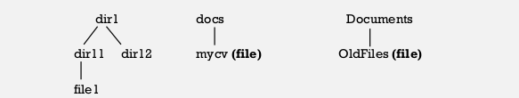
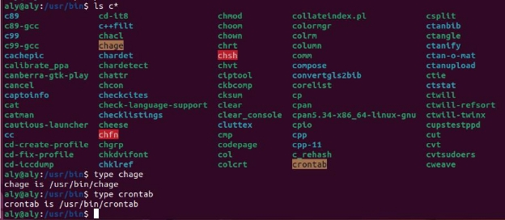
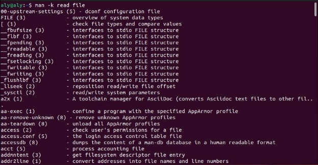

# Task 1

###### Q1) List three Linux Distributions.

Ubuntu, fedora, Red Hat.

###### Q2) what is the man command used for?

That's the traditional Unix documentation system that provides short reference manuals for individual commands

###### Q3) What is the difference between rm and rmdir using man command?

rm – remove files or directories

rmdir – remove empty directories

###### Q4)  Create the following hierarchy under your home directory:

​                                                              

###### a. Remove dir11 with rmdir in one-step. What did you notice? And how did you overcome that?

failed to remove ‘dir11’: Directory not empty, By using rm -r
                                                             

###### b. Then remove OldFiles using rmdir –p command. State what happened to the hierarchy (Note: you are in your home directory).      

######                                                                                   

###### c. The output of the command pwd was /home/user. Write the absolute and relative path for the file mycv

	absoulte : /home/aly/docs/mycv

`relative :  /docs/mycv`

###### Q5) Copy the /etc/passwd file to your home directory making its name is mypasswd

​                                                              

###### Q6)6. Rename this new file to be oldpasswd

###### Q7) 7. You are in /usr/bin, list four ways to go to your home directory

1. `cd`

2. `cd ~`

3. `cd ../../home/aly`

4. `cd $HOME`

5. `cd /home/aly`

   

###### Q8) List Linux commands in /usr/bin that start with letter w

​                                                           

###### Q9) What command type are used for? 

Display information about command type

###### Q10)Show 2 types of command file in /usr/bin that start with letter c

​                                                           

###### Q11)Using man command find the command to read file.

​                                                           

###### Q12)What is the usage of apropos command?

same is man -k, search the manual page names and descriptions

###### Last Exercice

Write a bash script to:

1. Create a directory called "myDirectory" in your home folder.
2. Inside "myDirectory," create another directory named "secondDirectory."
3. Within "secondDirectory," create a file named "myNotePaper."
4. Copy "myNotePaper" from "secondDirectory" to "myDirectory."
5. Rename the copied file in "myDirectory" to "myOldNotePaper."
  At the beginning of the script please add the following line in line 0 of the text file
  created [#!/bin/bash] this call shebang which indicates that the script should be
  interpreted and executed using the Bash shell.

  

  ###### "The Bash script is uploaded in Task1 Directory"