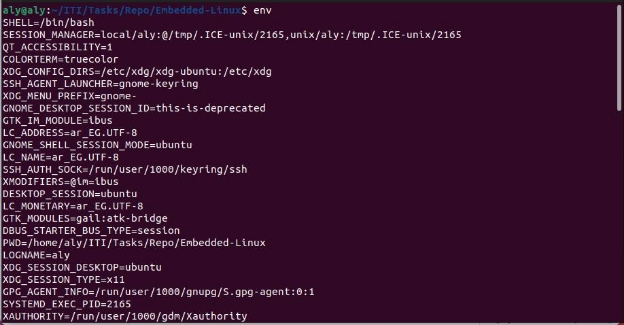

###### Q1) List the available shells in your system.

###### Q2) List the environment variables in your current shell.

This screen-shot is just a part of the terminal not all of it

###### Q3) Display your current shell name.

###### Q4)Execute the following command :

###### echo \ then press enter

###### What is the purpose of \ ?

Usually In the echo command, the backslash (\) character is used as an escape character. It is used to give special meaning to the character that follows it.

But in this case it gives the user a new line to add the input for the echo command. 

###### Q5)Create a Bash shell alias named PrintPath for the “echo $PATH” command

