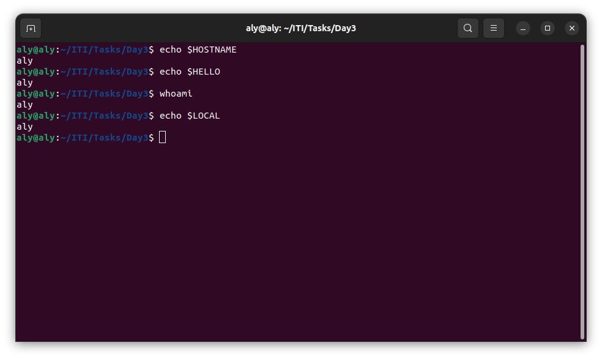
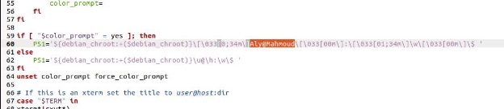

# Task 3


## Section 1:

i made a BashScript_Day3 in that bashscript it checks IF the .bashrc file exists in the user's home
directory. If it does, it appends new environment variables to the file: one called
HELLO with the value of HOSTNAME, and another local variable called LOCAL
with the value of the whoami command. Additionally, the script includes a
command to open another terminal at the end.

here is what happens when i open a new terminal 



## Section 2:


###### Q1) List the user commands and redirect the output to /tmp/commands.list

i uploaded the /tmp/commands.list file

###### Q2) Edit in your profile to display date at login and change your prompt permanently.

echo -n "the date is:"; date

I changed the name of user and local machine name and changed the color from green to blue




###### Q3) What is the command to count the word in a file or number of file in directory.

by using the command “wc” in case of file but in case of multiple files in directory we use “wc -w documents/\*” to count the number of words in each file and the total


###### a. Count the number of user commands

If want to count the number of files inside a directory we may use “ls- nameofyourdirectory | wc -l


###### Q4) What happens if you execute:

###### a) cat filename1 | cat filename2


###### b) ls | rm

it would not do anything more than rm directly if “ls | rm” is used it would give error as rm would need an operand.


###### c) ls /etc/passwd | wc –l


###### Q5) Write a command to search for all files on the system that, its name is “.profile”.

find / --name .profile


###### Q6) List the inode numbers of

a) ls -i /


b) ls -i /


c) ls -i /etc/hosts


###### Q7) Create a symbolic link of /etc/passwd in /boot.


###### Q8)Create a hard link of /etc/passwd in /boot. 


###### Could you? 

Yes

###### Why?

as i only have one partition when installing Ubunto.

###### 9)Echo \ it will jump to the next line, and will print >, Notice the prompt ”>” what is that? 

the > prompt is displayed, indicating that the shell is waiting for additional input to complete the command started with echo. After you provide the missing part of the command, the shell executes it.

###### how can you change it from “>” to “:”.

open your terminal and write the following command:

```bash
nano ~/.bashrc
```

Write this following line:

`PS2=":"`

this will overwrite the PS2 variable by : changing it from > to :
