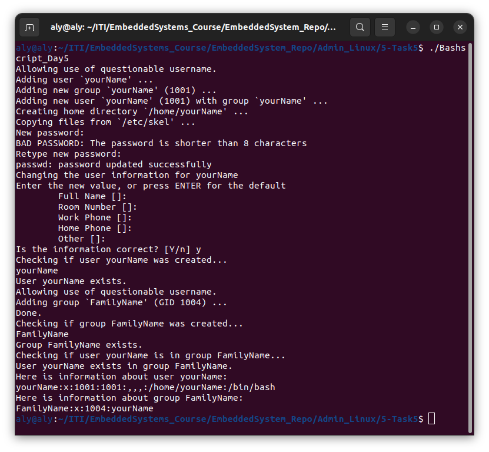
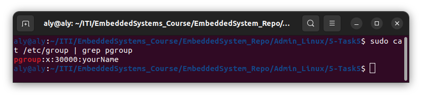
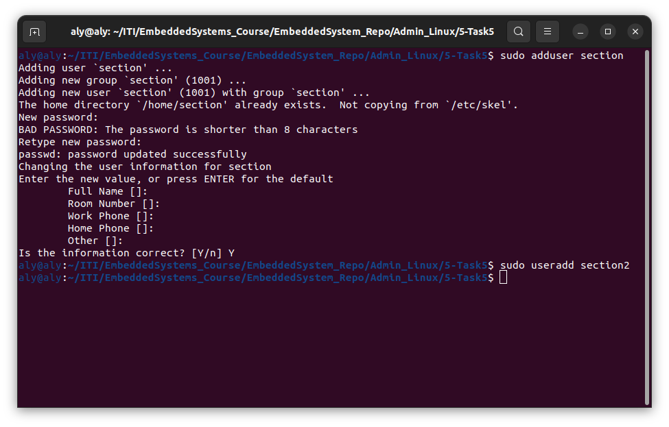

# Task 5

## Section 1

the bash script for task 5 creates user by the name of '**yourName**' which is a bad name but was handled anyway you can continue adding password and other relative info about that user, and the bashscript continues to add that user in a group and that group is named '**FamilyName**' which is again a bad name but it was handled anyway, it also checks if that user or group already exist and print the status of each and every step, at last it displays relative info about user and group.

here is a screen-shot from the output of the bash file script.

## Section 2

1. ###### Create a supplementary (Secondary) group called pgroup with group ID of 30000

first we need to make the group with that specific id by the next command:

`sudo groupadd -g 30000 pgroup`

then we need to make it as a secondary group for user 'yourname' by the following command:
`sudo usermod -aG pgroup yourName`

then we need to make sure that the prevoius two steps were made correctly by executing the following command:

`sudo cat /etc/group | grep pgroup`

here is the expected output:
                                     

you can notice here the id of the group and the members of the group.

2. ###### Lock any user created account so he can't log in

   in order to lock the password use of user you can use the following command

   `sudo usermod -L yourName`

   notice here i did choose the user that i want to lock which is **yourName** user 

   

3. ###### Delete user account

   in order to delete a user account you need to execute the following command:
   `sudo userdel -r yourName`

4. ###### Delete group account 

   in order to delete a user account you need to execute the following command:

   `sudo groupdel FamilyName`

   

5. ###### State the difference between `adduser` and `useradd` with example shown.

`adduser` is interactive and user friendly, lets you set password and other data 
`useradd`is creates a user account with default configuration and you might need to change it on your own with different commands 

here is an example to visualize this info:

​                           
