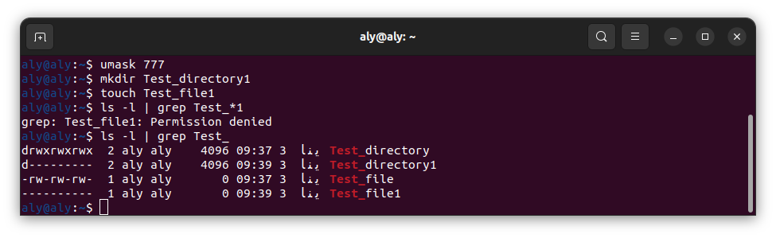
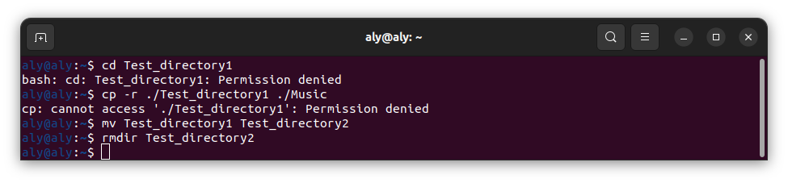
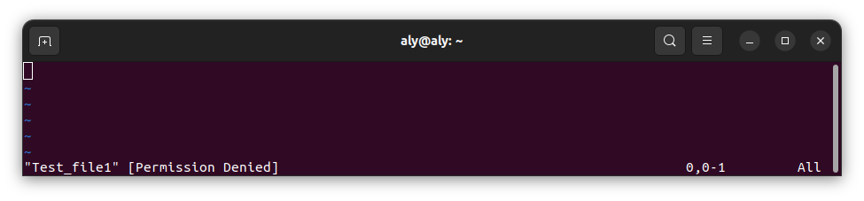
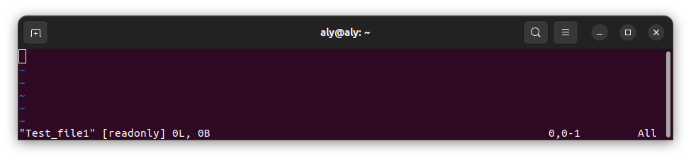
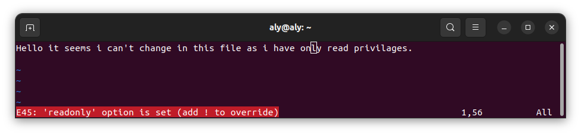
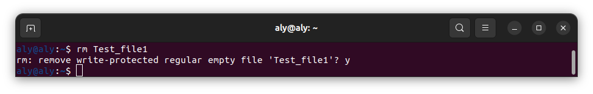
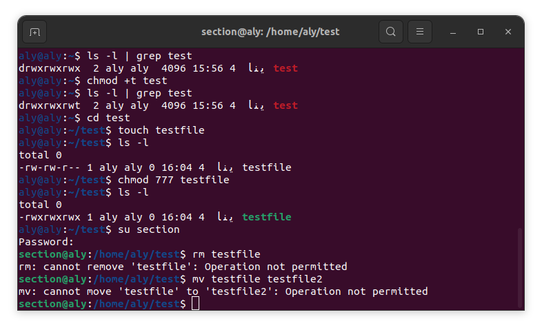
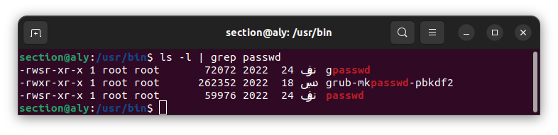

# Task 6

## Section 1:

###### 1.Create a folder called myteam in your home directory and change its permissions to read only for the owner.

  to go to home directory 
  `cd ~`

  in order to create directory called myteam we need to execute this command:

  `mkdir myteam`

  to see the permission of this directory 

  `ls -l |grep myteam`

  the output should look like this 

  `drwxrwxr-x  2 aly aly    4096 ينا  3 00:38 myteam`

  there is multiple ways to make this directory read only for owner, this is one of them

  `chmod u-wx myteam `

  check the permissions again with this command:

  `ls -l |grep myteam`

  the output should be like this

  `dr--rwxr--w 2 aly aly    4096 ينا  3 00:38 myteam`

###### 2.Log out and log in by another user

in order to log out one need to press logout from the top right dropdown menu

then choose another user to log in with 

###### 3.Try to access (by cd command) the folder (myteam)

`bash: cd: myteam: Permission denied`

###### 4.Using the command Line

###### a. Change the permissions of oldpasswd file to give owner read and write permissions and for group write and execute and execute only for the others
(using chmod in 2 different ways)

to list the permissions of oldpasswd file we need to use this command 

   `ls -l | grep oldpasswd`

   this is my output 

   `-rw-r--r--  1 aly aly    2971 ديس  2 19:48 oldpasswd`

   to change it to the desired permissions 

   1st way:`chmod 631 oldpasswd`

   2nd way: `chmod g-r+wx oldpasswd`
                    `chmod o-r+x oldpasswd`

   ###### c. What is the maximum permission a file can have, by default when it is just created? And what is that for directory.

   max permission is 777 which means rwx for owner user and other

   by default for file:

   **-rw-rw-r--**  

   by default for directory:

   **drwxrwxr-x** 

   

###### d. Change your default permissions to be no permission to everyone then create a directory and a file to verify.

in order to change the default permissions for directories and files you need to execute this command

`umask 777`

you can change the 777 to any permission you want

now we need to test this command by making new directory and new file 

`mkdir test_dir`
`touch test_file`

to see the permission of the new directory and file 

`ls -l | grep test`

here is the new directory and file permissions 

###### e. State who can access a this file if any with proof.

apparently the owner can do some writing processes even if he does not have any permission to do so.

here is when i tried to write over in Test_file1 

as you can see i have no permission to save my changes.

however the root can access all the directories and the files as root does have full privileges 

so  i did write this command 

`sudo vim Test_file1`
this gives the user root privileges for this command 

as you can see now i can save my changes.

###### 5.Create a file with permission 444. Try to edit in it and to remove it? Note what happened.

to change a file permission we need to execute the following command 

`chmod 444 Test_file1`

here is what happened when i try to edit in it

​	as one can notice i can not write over it as i don't have writing privileges.

​	to remove file one need to execute the following command:

​	`rm Test_file1`
​	
as one can see i need to remove write_protect on that file to remove it i did so by writing `y` and then pressing `Enter` in my keyboard.

###### 6.What is the difference between the “x” permission for a file and for a directory?

​	a. for files:
​		For files, the execute permission means the ability to execute the file  as a program. If a user has execute permission on a file, they can run  it as a command or execute it in some way, depending on the file type.  This is crucial for scripts, binaries, and executable files.

​	b. for directories 
​			For directories, the execute permission is commonly referred to as the  "traverse" permission. This permission allows a user to access and  traverse the directory, i.e., enter into it to access its contents.  Without execute permission on a directory, a user won't be able to  access files or subdirectories inside, even if they have read permission on the directory.

## Section 2

###### 	Create a new directory.

​	to create a directory we need to use the following command

​	`mkdir test_dir`

​	to check the permissions for this directory we need to use 

​	`ls -l` 

​	in my case this was my output 

​	`drwxrwxr-x 2 aly aly 4096 ينا  3 22:29 test_dir`

###### 	1. Set the sticky bit on the newly created directory.

​	using the following command:

​	`chmod +t test_dir`

​	to check the permissions for this directory we need to use 

​	`ls -l` 

​	in my case this was my output 

​	`drwxrwxr-t 2 aly aly 4096 ينا  3 22:29 test_dir`

###### 	2. set the setgui bit on the created directory

​	to do that we need to execute this command:

​	`chmod g+s test_dir`

​	

###### 	3. Create multiple user accounts.

​	to add new user youcan use 
​	`useradd` or `adduser`

​	

###### 	4. Allow these users to create files within the directory and directory.

​	in order to make users access the owner directory you need to add user to the owner's group by this command:

​	`sudo usermod -aG aly ali`

then we need to give this group the permissions needed by:

`chmod g+rwx test`

after that we should be able to access this directory read,write and execute it

we can put that to test by switching to another user

`su ali`

then use commands on it like

`cd test`

`mkdir ali_test`

###### 5.Attempt to delete or rename each other's files.

`rmdir test_dir`
it was deleted successfully as ali was in the same group as aly, but i understand that other user outside group should not be able to rename or delete this directory.

###### 6.Provide a clear output demonstrating the impact of the sticky bit on file deletion and renaming within the directory.

​	let's make a directory to show the impact of sticky bit named test by this command 

​	`mkdir test`

​	let's see what are the default permissions for this directory 

​	`ls -l | grep test`

​	we can see in the picture below the permission however we need to add the sticky bit permission 

​	`chmod +t test`

​	let's see what are the permissions for this directory now.

​	`ls -l | grep test`

​	we can see in others permission instead of x we see t that stands for sticky bit.

​	let's create a new file inside that directory 

​	`touch testfile`

​	let's see what are the default permissions for this file

​	`ls -l | grep test`

​	we can see that file does have only read permission for other users in the picture below

​	let's grand this file every permission

​	`chmod 777 testfile`

​	let's see what are the permissions for this file now.

​	`ls -l | grep test`

​	we can see that it was granted every permission 

​	let's switch user and test removal and naming of that file 

​	to switch user we can use 

​	`su section`

​	to remove  that file 

​	`rm testfile`

​	to rename that file 

​	`mv testfile testfile2`

​	we can see that both of these commands were not executed as we even tho we have permissions to execute 

###### 	**Conc.** 

​		sticky bit gives the owner of the file in that directory the permission to remove or rename files in that directory for owner of the directory and the owner of that directory only even tho other users might have execution permissions.

###### 7.Provide a clear output for the directory created.

###### list the permission passwd command has and explain why it has s 

there might be some confusion passwd command in /user/bin/passwd does not have s in it's permissions 

S permission in general stands for Setuid and it means that whatever file that hold s in it's permissions any regular use can have the privileges of the owner.
