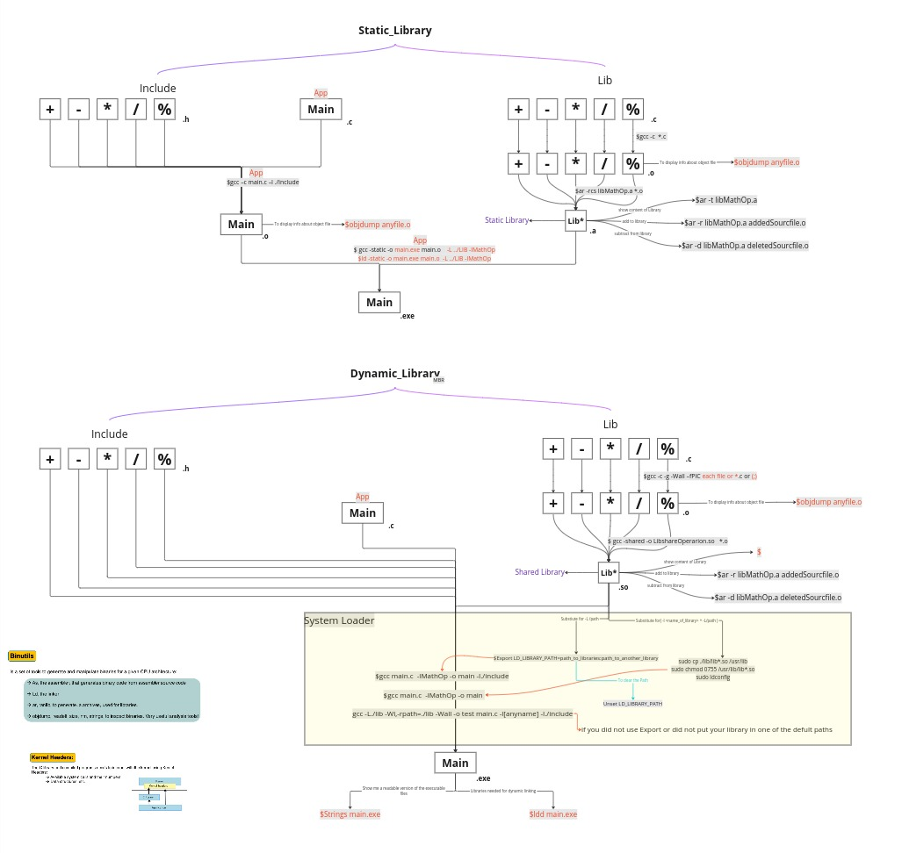
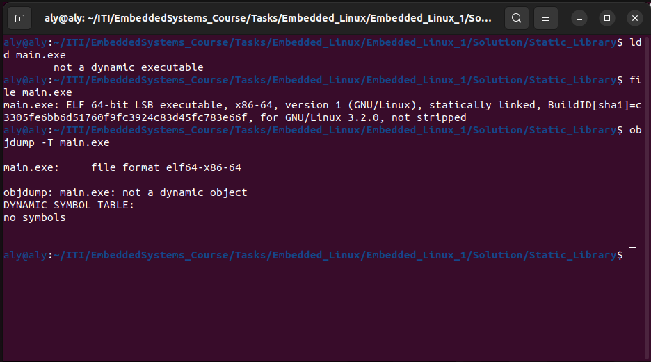
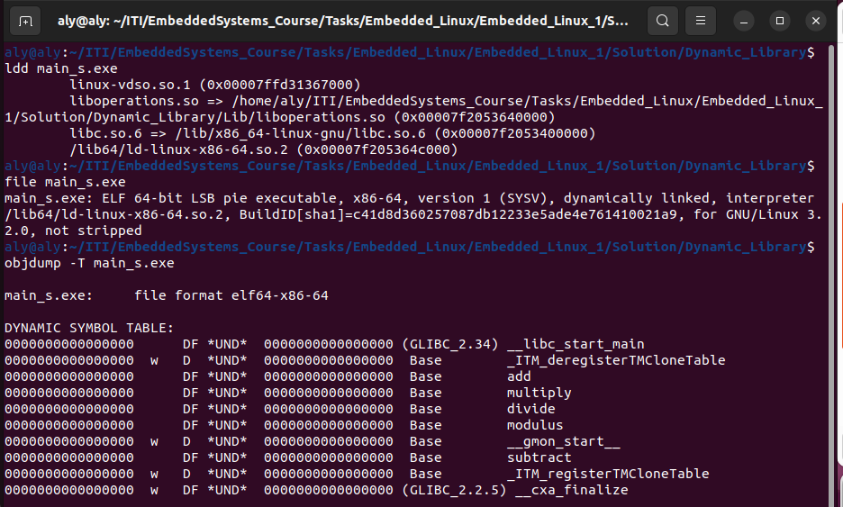

# EmbeddedLinux_Task1

## Section 1 

###### Creating Calculator Libraries and Application both static and dynamic 

here is a mind map with the commands that helps to visualize what was done to create both of those libraries

for a full a higher quality of this mind map you can visit the link below:
 https://miro.com/app/board/uXjVNFXPNbs=/?moveToWidget=3458764574193344136&cot=14

## Section 2

###### compare between static library and dynamic library.

to compare between those libraries we will use the following commands 

**1.**`ldd` 

`ldd` is used to know what are the files that the executable will need in runtime and this is needed in dynamic library as the libraries are separated from the executable file.

**2.** `file`
   `file`  it's used to know the type of the file we will use it on the executable file to know if it is dynamically linked to statically linked 

**3.**`objdmp`
 `objdump`it's used to show the dynamic symbol table 

here is the output of these command on the static and dynamic executable.

 

