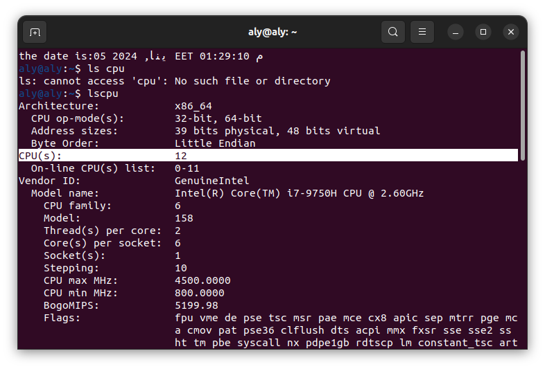
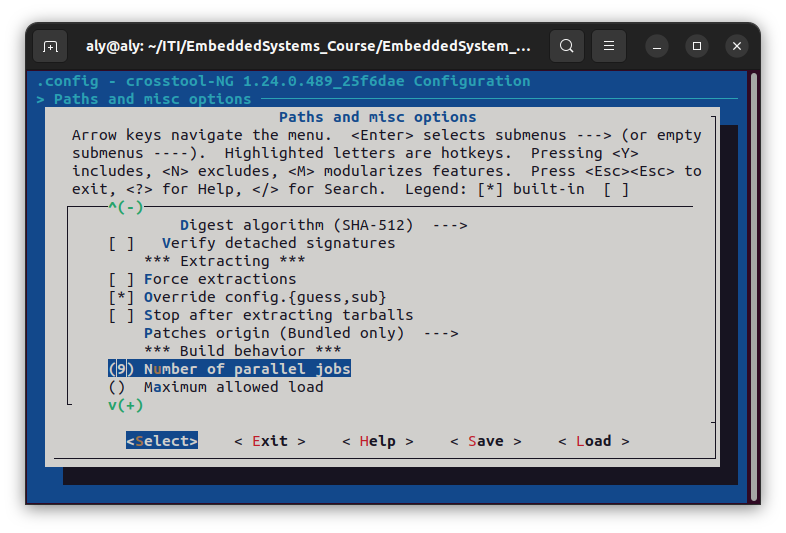
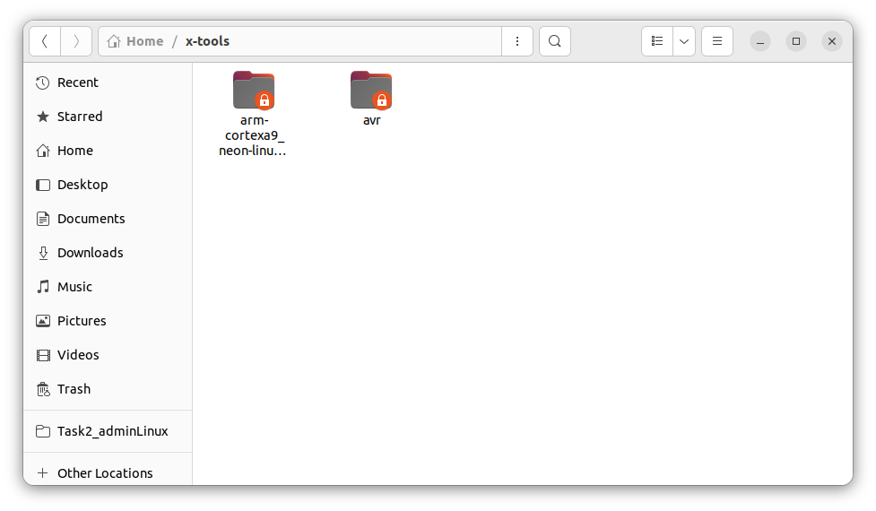

# EmbeddedLinux_Lec2Task3

## How to make an arm tool-chain for your project

### Req:

Make sure it support:

​	Musl library
​	Make
​	Strace

### pre-requist: 

In order your build complete successfully you are required to download some
application and library on your system.
sudo apt install build-essential git autoconf bison flex texinfo help2man gawk \
libtool-bin libncurses5-dev unzip

### The steps to make arm cortex a9 toolchain

0- Go to the path where you installed crosstool-ng & opem a terminal in that path

1- Setup the environment 

`./bootstrap`

2- Check all dependencies 

`./configure --enable-local`

3- Generate the Makefile for crosstool-ng

`make`

4- List the needed micro-controller

`./ct-ng list-samples | grep arm`

different arm architectures will be listed

choose this one

**arm-cortexa9_neon-linux-gnueabihf**

5- Configure the micro-controller used

`./ct-ng arm-cortexa9_neon-linux-gnueabihf`

6- Configure toolchain

`./ct-ng menuconfig`

an GUI will open and you can make your need configuration

 	6.1 choose Path and misc options 		

6.2 choose **Debug crosstool-NG**

then a drop down items will appear choose **Save intermediate steps** in order to save most of the process if the process failed while executing for whatever reason

​	then, choose **Interactive shell on failed commands** in order to see if any error happened while executing this will save some time instead of looking in another file where did the problem happen and what is the problem

here is a screen-shot of how it would look like

​					

scroll down until you see Number of parrallel jobs

you should choose accordingly to the number of processors( CPU(s) ) you have 
in order to know that you can open a new terminal (alt+ctrl+t)

write this command 
`lscpu`

as you can see in the above screen-shot i have 12 CPU(s) i wil use 75% of these CPU(s) -> 9 to do the toolchain process and will have the rest -> 3 to handle the Operating system this is a good rule of thumb you can choose whatever you want.

then you should put that number in your configuration 

6.3 Go back to the main menu by double pressing ESC button
6.4 go to **C-Library**

6.5 choose **C library** 

6.6 then choose **musl** lib

6.7 go back to the main menu by double pressing ESC
6.8 then choose **Debug facilities**

6.9 Then choose **strace**

​						
​	6.10 go back to the main menu by double pressing ESC
​	6.11 then choose **Companion tools**
​					
​	6.12 Choose **make** 

​	6.13 then we can save and/or press ESC and save 

​	after setting all of the configuration needed we can build using the next command

​	`./ct-ng build`
​	
​	you can rest and relax till it builds this will take a while ...

​	now you are going to have one of **two scenarios** 
​	1- **Error** 
 		usually the error is straight forward with little googling or chatGPT it will be solved
​	
​	2-**Congrats it worked!**
​		now go to your home directory you will find directory x-tool go into it you should see the arm compiler directory 

you should see output like this in terminal 

​					

in Home/x-tools

## Explanation of what is inside Sysroot and bin

## Sysroot

In the context of ARM development, a sysroot refers to the system root directory that contains the essential files and libraries  needed for cross-compiling and building software for a target ARM  architecture. The sysroot provides a isolated environment that mirrors  the target system's file structure and includes the necessary headers,  libraries, and other resources It contains :

### usr/lib

It contains important static and dynamic libraries that user will use it or add new libraries on it

### usr/bin

It contains binary files for applications that will be used on the target

### usr/include

It contains header files of the libraries that will be used

### lib

It contains system libraries like spin

------

## bin

It contains all important Binutils  as , Binutils is a  collection of binary utility tools that are essential for the  development and manipulation of binary files, including executable  programs and object files. These tools are crucial in the compilation,  linking, and debugging stages of software development.

Components of Binutils:

- ar
- as
- ld
- objcopy
- objdump
- strip
- nm
- ranlib
- readelf
