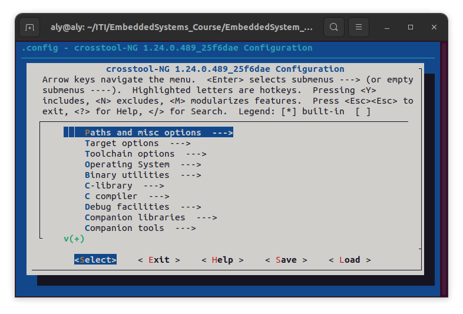
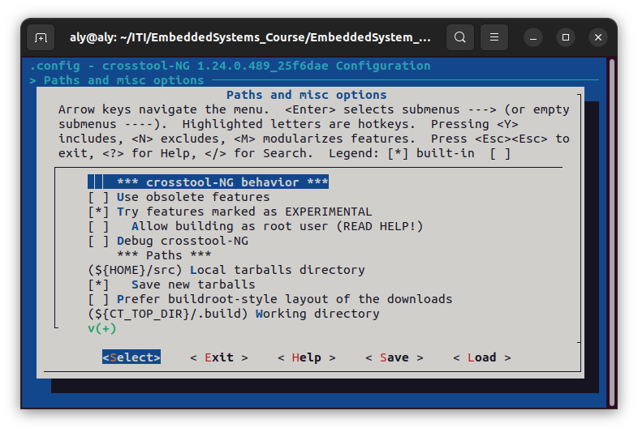
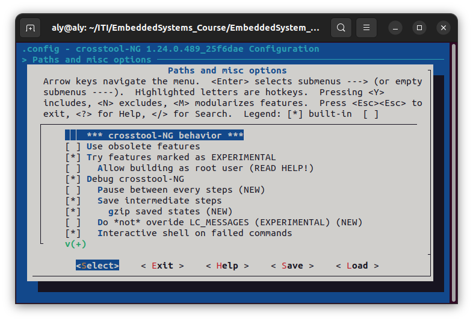
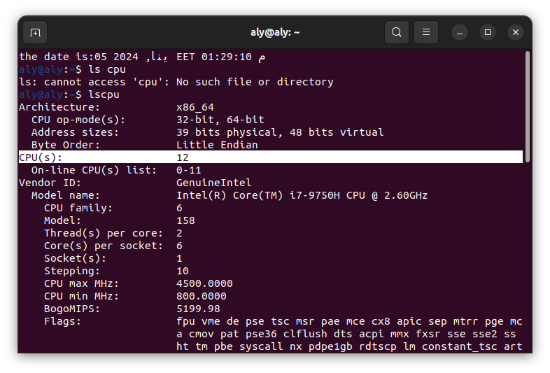
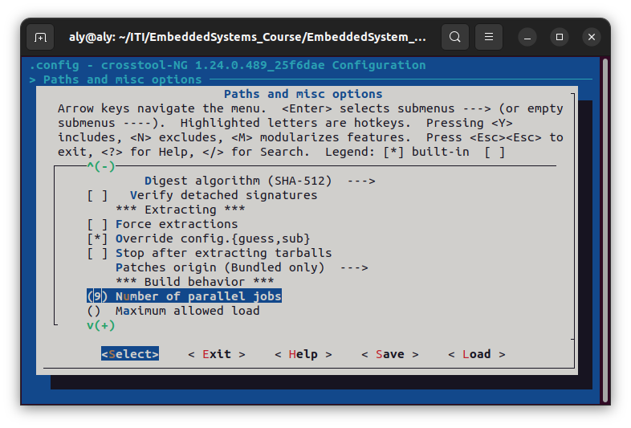
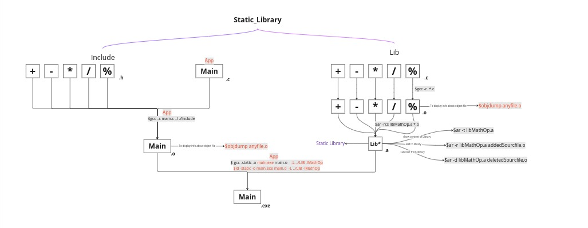
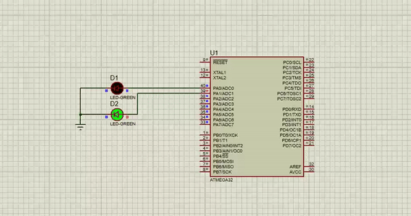

# EmbeddedLinux_Lec2Task4

## Task

develop a static library for the Micro-controller Abstraction Layer (MCAL) of your AVR drivers. The library, named libmcal.a, is intended to be used in AVR applications.


### Pre-Requist

you must have  the AVR compiler to be able to compile files for AVR micro-controller, following is procedure on how to do that 

 

#### 1. The steps to make AVR toolchain

##### 1.0- Go to the path where you installed crosstool-ng & opem a terminal in that path

##### 1.1- Setup the environment 

`./bootstrap`

##### 1.2- Check all dependencies 

`./configure --enable-local`

##### 1.3- Generate the Makefile for crosstool-ng

`make`

##### 1.4- List the needed micro-controller

./ct-ng list-samples | grep avr

different arm architectures will be listed

choose this one

AVR

##### 1.5- Configure the micro-controller used

`./ct-ng AVR`

##### 1.6- Configure toolchain

`./ct-ng menuconfig`

an GUI will open and you can make your need configuration




###### 1.6.1 choose Path and misc options 		



###### 1.6.2 choose **Debug crosstool-NG**

then a drop down items will appear choose **Save intermediate steps** in order to save most of the process if the process failed while executing for whatever reason

​	then, choose **Interactive shell on failed commands** in order to see if any error happened while executing this will save some time instead of looking in another file where did the problem happen and what is the problem

here is a screen-shot of how it would look like


​					

scroll down until you see Number of parallel jobs

you should choose accordingly to the number of processors( CPU(s) ) you have 
in order to know that you can open a new terminal (alt+ctrl+t)

write this command 
`lscpu`



as you can see in the above screen-shot i have 12 CPU(s) i wil use 75% of these CPU(s) -> 9 to do the toolchain process and will have the rest -> 3 to handle the Operating system this is a good rule of thumb you can choose whatever you want.

then you should put that number in your configuration 



#### 2. Adding our AVR compiler to our environment PATH to exectute AVR command


##### 2.1Open ./bashrc

```
nano ~/.bashrc
```

##### 2.2 Add the PATH of AVR to environment PATH in .bashrc to load every time i open the terminal

```
export PATH=$PATH:~/x-tools/avr/bin
```

##### 2.3 Apply the changes to my current session.

```
source .bashrc 
```

##### 2.4 Confirm that the directory is now in my PATH

```
echo $PATH
```

the output should have AVR compile in it's Path

##### 2.5 Run avr-gcc as now we can run it from any place (Final Check)

```
avr-gcc --version
```


## Developing Static library for AVR

in the next picture you can see how to develop any static_library however it's important to note that this commands you see is for x86 not AVR 
to develiop for AVR you need to keep the same steps only change the following:



#### 1. use avr-gcc instead of gcc

#### 2. in the step of generating an executable

you must add the following `-mmcu=atmega32` to specify which AVR micro-controller you are working on


#### Testing my compiled main.elf in Proteus 




## Advantages of Static Libraries in AVR Applications

### 1. Resource Efficiency

**Static Linking:** When using a static  library, the linker includes only the necessary functions and data  directly into the executable during the linking phase. This results in a smaller and more efficient binary since it only contains the code that  is essential for the application.


### 2. Predictable Memory Usage

**Memory Constraints:** AVR microcontrollers  often have limited resources, including flash memory and RAM. With  static libraries, the memory usage is more predictable, as the linker  resolves symbols at compile-time, enabling a clearer understanding of  the memory footprint of the application.


### 3. Reduced Run-Time Overhead

**No Dynamic Loading:** Dynamic libraries  incur run-time overhead due to dynamic loading and linking. In embedded  systems where real-time performance is critical, avoiding this overhead  is beneficial. Static libraries eliminate the need for dynamic loading,  resulting in faster startup times.


### 4. Deterministic Behavior

**Compile-Time Binding:** Static libraries  provide compile-time binding of functions, ensuring that the  application's behavior is determined at compile-time rather than  run-time. This deterministic behavior is desirable in embedded systems  where consistency and reliability are crucial.
