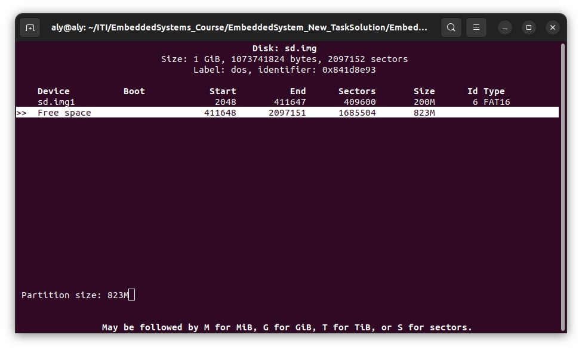

# Virtual memory for the virtual Beagle Bone  "Qemu".

## Why do we need to make a virtual memory in the first place?

Beagle Bone is a pricey HW to buy so we are going to work on a virtual Beagle Bone "Qemu" and for the virtual Beagle Bone booting sequence we need to have memory to put the needed data onto the beagle bone, in real life we would use an SD card but we can create a virtual SD card to put our data onto

## How to make a virtual memory?

### 1- We need to create a file of size 1 GB filled with zeros

```
dd if=/dev/zero of=sd.img bs=1M count=1024
```

here is a break down of this command:

- **`dd`:** The command itself, standing for "data dump" or "disk dump." It is a command-line utility used for copying and converting data.
- **`if=/dev/zero`:** This option specifies the input file (`if`). In this case, it's `/dev/zero`, which is a special file on Unix-like systems that provides an endless stream of null bytes (zeros) when read.
- **`of=sd.img`:** This option specifies the output file (`of`). In this case, it's `sd.img`, the file where the output data will be written.
- **`bs=1M`:** This option sets the block size (`bs`) for the data transfer. Here, it's set to 1 megabyte (`1M`). The block size determines how much data is read from the input file and written to the output file in each operation.
- **`count=1024`:** This option sets the number of blocks (`count`) to be copied. In this example, it's set to 1024. With a block size of 1 megabyte, this means a total of 1024 megabytes (or 1 gigabyte) of data will be copied from `/dev/zero` to `sd.img`.

So, the overall command is creating a disk image file (`sd.img`) filled with 1 gigabyte of null bytes

### 2- Configure the Partition Table for the SD card

cfdisk is a user friendly GUI that will help us configure SD card

```
cfdisk sd.img
```

2.1 Selecting label type
			

for the convince of beagle bone we will be choosing `dos` partitioning option

after choosing `dos`option we need to create new partitions for our SDcard

#### 1st Partition 


Choose `New`

​			
specify the `Partition size` : 200M 
**make sure to write the M it's not in the screenshot**


to make it bootable partition we need to choose `primary`
		 

and then we need to choose `Bootable` 


we can see that there is a `sd.img1` created and it's bootable 

and finally we need to choose `Type` 

​		 
and then choose `FAT16`

​		


#### 2nd Partition

scroll down to the Free space and choose `New`


keep the reaming size

​		
choose `extended`

​		

Choose `Type` 


​		

Choose `Linux`

​		

Choose `Write`  to save your configuration 


write `yes`  

and then you can `Quit`


### 3-Emulate the sd.img as a SDcard

#### 3.1 attach the sd.img to be treated as block storage

```
sudo losetup -f --show --partscan sd.img
```

command breakdown:


`losetup`: This command is used to set up and control loop devices, which allow a regular file to be accessed as a block device.

`-f:` This option is used to find the first available loop device. It tells losetup to search for the first free loop device.

`--show`: This option tells losetup to print the name of the loop device it associates with the specified file.

`--partscan`: This option instructs losetup to read partition table information from the file (sd.img in this case) and create loop devices for each partition found.

the output of this command in my case is: 

`/dev/loop26`

#### 3.2 Assign the Block device as global variable to be treated as MACRO

`export DISK=/dev/loop26`

#### 3.3 Formating the first partition as FAT

```
sudo mkfs.vfat -F 16 -n boot ${DISK}p1
```

here is a break down of the command 

**`mkfs.vfat`:** This command is used to create a FAT (File Allocation Table) file system on a device.

**`-F 16`:** This option specifies the FAT type to be used. In this case, `-F 16` indicates that the FAT16 file system should be created. FAT16 supports smaller partition sizes compared to FAT32 but may be more compatible with certain systems.

**`-n boot`:** This option sets the volume label of the file system to "boot." The volume label is a human-readable name for the file system.


after this command
you will find the boot partition is on your task bar


#### 3.4 Formating the first partition as ext4

```
sudo mkfs.ext4 -L rootfs ${DISK}p2
```


after this command
you will find the boot partition is on your task bar
